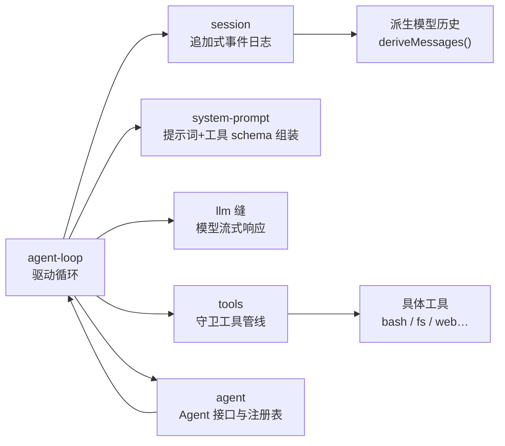
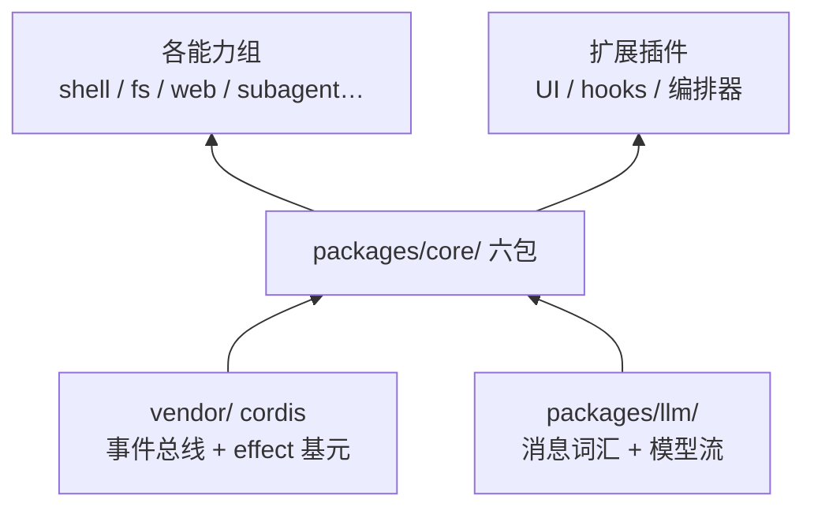

# 【第 02 篇】packages/core/：会话可重建、工具可安全执行、循环可观测

> 难度：🟡 进阶（建议先读第 01 篇与官方 cordis-tutorial 1~3 章）
> 前置阅读：`../项目架构总览.md`、`第01篇-vendor-Cordis框架层.md`
> 对应目录：`deepseek-harness/packages/core/`

## 目录

- [0 功能需求（WHY）](#0-功能需求why)
- [1 架构设计（WHAT）](#1-架构设计what)
- [2 实现落点（HOW）](#2-实现落点how)
- [3 产物演示（EXAMPLE）](#3-产物演示example)
- [4 动手验证](#4-动手验证🧪)
- [5 FAQ 与自测](#5-faq-与自测❓)
- [6 延伸阅读](#6-延伸阅读📚)

---

## 0 功能需求（WHY）

### 0.1 背景与场景

一个 Agent 要真正干活，必须有三个器官：**记忆**（记住聊了什么、做了什幺）、**手脚**（真的去执行命令、读写文件）、**大脑**（决定每一步做什么、什么时候结束）。`packages/core/` 就是这三个器官的所在地——它是**每个组合都必须启动的主干**（官方称 "the packages every composition boots"）。

三个典型场景驱动了本组需求：

1. **断线重连**：Web 会话刷新、SDK 客户端重连后，Agent 必须恢复完整上下文——模型看到的和断线前一模一样；
2. **危险操作**：模型请求"执行 `rm -rf`"或"读 `/etc/shadow`"——系统必须有办法在**执行前**拦截、加策略、限超时；
3. **过程可见**：用户在 GUI 里要实时看到"正在思考 → 调用工具 → 工具返回 → 继续"的每一步，而不是等最终结果。

### 0.2 需求陈述

**R1 · 会话可持久重建**——Agent 的全部交互事实以**追加式事件日志**记录；任何时点，模型可见的一切都能从日志重新推导出来，不另存一份"消息数组"。

- 实例：`bash-tool-turn` 快照里，一次简单的"跑个 echo 再回答 DONE"的会话，日志记录了 35 个事件（含 14 个 token 级流块）。
- 为什么必须：断线重连、fork、回放、UI 渲染、标题生成、遥测都要从同一个真相源派生——多份拷贝必然漂移。

**R2 · 工具可安全执行**——模型发起的工具调用必须经过**守卫管线**：策略检查、超时、并发限制、结果校验，全部在"真正执行"之前/之后发生。

- 实例：`fs` 的"先读后写"策略就是挂在 `fs/*` 事件上的守卫，模型想改文件必须先读过它。
- 为什么必须：模型输出不可信；没有守卫管线，"执行工具"就是"让模型任意执行代码"。

**R3 · 循环可观测**——turn/step 全流程（入队、开轮、请求、流式、工具、收尾）以**事件**广播，UI、SDK、钩子插件都能观察，还能在瀑布事件上拦截。

- 实例：Web GUI 的每一步渲染都来自 `session/event` 流，而不是轮询。
- 为什么必须：不可观测的循环 = 无法调试、无法做 UI、无法做策略。

**R4 · 主干可替换**——`agent-loop` 只是 `Agent` 契约的**默认实现**；扩展插件依赖 `agent` 接口，绝不依赖 `agent-loop` 具体类，因此整个循环可被换掉。

- 实例：`ctx.agents.setFactory()` 允许其他实现注册自己的驱动。
- 为什么必须：主干是产品的心脏，但心脏也必须遵守"没有特权内核"（第 01 篇 P1）。

### 0.3 非功能需求

| 编号 | 约束 | 衡量方式 |
|---|---|---|
| N1 | **无损**：每个事件必须是 lossless JSON，seq 连续，包括原始流块 | 持久化可逐字节存储规范日志 |
| N2 | **可重放**：模型历史由日志派生，replay = 重新派生 | 同一日志两次派生结果一致 |
| N3 | **可扩展**：事件词汇表可合并扩展（声明合并），不破坏既有事件 | 插件可加 `compaction/*` 等新事件 |
| N4 | **可拦截**：关键环节是 waterfall 事件，监听者不调 `next()` 即可截停 | `agent/pre-step`、`tools/execute` 均可否决 |
| N5 | **可诊断**：循环每个状态迁移都镜像为 `agent/status` 事件 | 状态机可完整回放 |

### 0.4 验收标准

| 需求 | 验收示例（做到 = 通过） | 失败示例（做不到 = 没通过） |
|---|---|---|
| R1 | 断线重连后模型上下文与断线前逐 token 一致 | 重连后模型"失忆" |
| R2 | 策略插件在 `tools/execute` 上拒绝某次调用，工具未执行 | 策略无法介入执行 |
| R3 | UI 从 `session/event` 流实时渲染 thinking → tool → result | UI 只能轮询最终结果 |
| R4 | 换一个 loop 实现注册到 `ctx.agents`，UI/钩子零改动 | 换 loop 要改所有消费者 |

### 0.5 边界与不做什么

- **不做模型适配**：消息词汇、流式协议属于 `packages/llm/`（core 消费它，不拥有它）。
- **不做持久化后端**：日志如何落盘（JSONL/SQLite）属于 `packages/session/session-persistence-*`。
- **不做具体工具**：bash、fs、web 等工具属于各自能力组；core 只提供"注册与执行"的骨架。
- **不做 UI**：渲染是 `packages/client/` 的事。

### 0.6 设计哲学（原则 → 引出的需求）

| 原则 | 内容 | 引出的需求 |
|---|---|---|
| P1 模型可见 ⟺ 已记录 | 任何到达模型请求的内容，必须能从会话日志重建；新模型可见输入 = 新会话事件 | R1 |
| P2 追加只读 | 日志只追加不修改；消息历史永远是派生视图 | R1 |
| P3 执行必经守卫 | 工具调用唯一入口是 `ctx.tools` 的守卫管线，旁路路径不存在 | R2 |
| P4 事件即契约 | 事件名由 `SessionEventMap`/声明合并定义，payload 即公开契约 | R3 |
| P5 依赖接口不依赖实现 | 扩展插件依赖 `agent`，永不依赖 `agent-loop` | R4 |

### 0.7 备选技术路径

| 路径 | 思路 | 优势 | 代价 | 需求匹配 |
|---|---|---|---|---|
| A. 快照式存储 | 每轮对话后整体覆盖保存"消息数组" | 实现简单、读快 | 无历史、无逐 token 保真、无法回放中间态、并发覆盖易丢 | R1 落空（不可重建中间态） |
| B. 事件溯源（**本项目**） | 只追加事实，一切状态是投影 | 可重建任意时点、可回放、可派生多视图 | 派生有成本；事件词汇需要治理 | 全面满足 R1~R3 |
| C. 无守卫直调 | 模型调用直接映射到系统调用 | 最快 | 模型输出不可信，等于把系统交给提示词 | R2 落空 |
| D. 守卫管线（**本项目**） | 注册/分类/策略/执行/结果全环节事件化 | 策略可插拔、可审计、可观察 | 管线有调度开销；策略必须文档化 | 满足 R2/R3 |
| E. 硬编码循环 | agent 循环写在"内核"里，不可换 | 无抽象成本 | 违反 P1；改循环 = 改内核 | R4 落空 |

**选型结论**：事件溯源（B）+ 守卫管线（D）+ 接口化循环（E 的反面）三者组合，正好把"记忆、手脚、大脑"全部变成**可重建、可拦截、可替换**的插件化器官。

## 1 架构设计（WHAT）

### 1.1 总体架构：一次 turn 流过六个包

官方对主干结构的表述：

<div style="border-left:4px solid #0969da;background:#f6f8fa;padding:10px 14px;margin:12px 0;border-radius:0 6px 6px 0">
<b>📖 原文</b>（docs/subsystems/core.md 第 9 行）：<i>"A turn flows through the six packages in one loop: the driver in agent-loop claims a queued prompt, opens a turn on the session log (ctx.sessions), assembles the request prefix through system-prompt (ctx.systemPrompt) and derives history from the log, streams the model response through the LLM seam, dispatches tool calls through the tool registry (ctx.tools), and appends every model-visible fact back onto the log."</i><br/>
<span style="color:#57606a">出处：</span>
<a href="../../deepseek-harness/docs/subsystems/core.md">本地打开</a> ·
<a href="https://github.com/deepseek-ai/deepseek-harness/blob/master/docs/subsystems/core.md#L9">GitHub 查看（第 9 行）</a>
</div>



**四步读懂**：

1. **`session`** 是唯一真相源（R1）：追加式 `SessionEvent` 日志；模型历史不是存起来的，而是 `deriveMessages()` 从日志**派生**的；
2. **`system-prompt`** 组装模型请求的前缀（prompt 分段 + 工具 schema 列表，R3）；
3. **`tools`** 是唯一执行入口（R2）：注册表持有 `ToolDefinition`，调用必经"预策略 → 单调守卫 → 分发 → 后策略 → 结果"管线；
4. **`agent` + `agent-loop`** 是大脑：`agent` 声明 `Agent` 接口、注册表与 `agent/*` 事件；`agent-loop` 是接口的唯一默认实现，驱动一次 turn = 上面 1~3 的编排（R4，loop 可换）。

> 小结：六包分工 = 记忆（session）· 组装（system-prompt）· 执行（tools）· 接口（agent）· 驱动（agent-loop）· 基元（scope）。

### 1.2 关键架构决策（需求 → 方案 → 权衡）

| # | 决策 | 对应需求 | 权衡 |
|---|---|---|---|
| D1 | **事件溯源**：模型可见 ⟺ 已记录，一切状态从日志派生 | R1 / N2 | 派生有成本；换来任意时点可重建、可回放 |
| D2 | **守卫管线**：工具调用唯一入口带 5 段管线 | R2 / N4 | 调度开销；换来策略可插拔、可审计 |
| D3 | **事件四域**：会话事件（durable）/ agent 事件（live）/ 能力事件（policy）/ 瀑布事件（可截停） | R3 | 事件语义需文档化（`@mode`）；换来分层可观察 |
| D4 | **loop 可换**：`ctx.agents.setFactory()` + 依赖 `agent` 不依赖 `agent-loop` | R4 | 多一层间接；换来主干可替换 |

### 1.3 关系网



- **依赖**：core 构建在 vendored cordis 之上；`llm` 提供消息词汇（`Message`/`StreamChunk`），core 消费它；
- **被依赖**：所有工具组（shell/fs/web）注册进 `ctx.tools`；UI、hooks、编排器只依赖 `agent` 接口与 `session/event` 流。

## 2 实现落点（HOW）

### 2.1 文件导航表（按阅读顺序）

| 顺序 | 文件（点击直达） | 关注点 | 对应需求 |
|---|---|---|---|
| 1 | [packages/core/session/src/types.ts](../deepseek-harness/packages/core/session/src/types.ts) | `SessionEventMap`：事件词汇表（约第 27 行起） | R1/R3 |
| 2 | [packages/core/session/src/index.ts](../deepseek-harness/packages/core/session/src/index.ts) | `Session` 类：append-only 日志与 store | R1 |
| 3 | [packages/core/tools/src/index.ts](../deepseek-harness/packages/core/tools/src/index.ts) | `ToolDefinition` 与守卫管线 | R2 |
| 4 | [packages/core/agent/src/index.ts](../deepseek-harness/packages/core/agent/src/index.ts) | `AgentRegistry`（create/resume/setFactory） | R4 |
| 5 | [packages/core/agent/src/types.ts](../deepseek-harness/packages/core/agent/src/types.ts) | `Agent` 接口（send/cancel/whenIdle） | R3/R4 |
| 6 | [packages/core/agent-loop/src](../deepseek-harness/packages/core/agent-loop/src) | 默认循环实现（扫读目录结构即可） | R3/R4 |
| 7 | [packages/core/system-prompt/src](../deepseek-harness/packages/core/system-prompt/src) | 提示词组装 | R3 |

### 2.2 关键实现片段

**片段 A：事件词汇表的一角——turn 的开始与结束**（[session/src/types.ts](../deepseek-harness/packages/core/session/src/types.ts)）

```ts
interface SessionEventMap {
  /** Opens turn `turn` before the loop claims queued input or runs pre-step. */
  'turn/start': { turn: number }
  /** Closes turn `turn` with the TurnEndReason that ended it. */
  'turn/end': { turn: number; reason: TurnEndReason }
  /** Opens step `step` of turn `turn` — one model call plus the tool executions it requested. */
  'step/start': { turn: number; step: number }
  /** Closes step `step` of turn `turn`. */
  'step/end': { turn: number; step: number }
}
```

翻译：四个事件定义了"轮"和"步"的边界（R3）。**turn** 是一次完整的交互轮次（从用户提问到最终答复）；**step** 是轮内的一次"模型请求 + 它触发的工具执行"——一个 turn 可以包含多个 step（模型调用工具后还要继续思考）。事件名是契约（P4）：任何插件都能监听、任何 UI 都能渲染，而 payload 就是公开协议。

**片段 B：工具的定义 = schema + 执行函数**（[tools/src/index.ts](../deepseek-harness/packages/core/tools/src/index.ts)）

```ts
interface ToolDefinition extends ToolSchema {
  readonly output: ToolOutputDefinition
  execute(args: unknown, exec: ToolRunContext): Promise<unknown>
}
```

翻译：一个注册的工具由两部分组成——**schema**（模型可见的调用说明，进提示词）和 **execute**（真正干活）。`output` 声明返回值的 JSON Schema，每次成功的结果都要通过校验（N1）。模型永远只看到 schema，永远碰不到 execute 内部——这就是"模型可安全调用"的结构基础（R2）。

**片段 C：Agent 接口的对外面**（[agent/src/types.ts](../deepseek-harness/packages/core/agent/src/types.ts)）

```ts
interface Agent {
  readonly id: SessionId
  readonly session: Session
  readonly status: AgentStatus
  readonly ctx: Context
  send(message: UserMessage, target: InboxTarget, wakeup: boolean): void
  cancel(cause: AgentCancelCause, options?: CancelOptions): void
  whenIdle(): Promise<void>
}
```

翻译：这是所有 UI/hook/编排插件编程面对的**唯一表面**（R4）。`send` 投递输入并唤醒驱动；`cancel` 带原因取消（首个原因生效）；`whenIdle` 等整个 agent 归于平静。注意它暴露 `session` 而不暴露"消息数组"——一切读操作都走日志派生（R1）。

### 2.3 符号 hover 指引

在 VS Code 打开 [packages/core/session/src/types.ts](../deepseek-harness/packages/core/session/src/types.ts)，hover `SessionEventMap` 或任一事件键可看官方 JSDoc（含 `@mode` 分发模式标注）；打开 [packages/core/tools/src/index.ts](../deepseek-harness/packages/core/tools/src/index.ts) hover `ToolDefinition.execute` 可看执行契约（信号、quiescence、返回值规范）。

## 3 产物演示（EXAMPLE）

### 3.1 输入

一个真实任务（来自仓库快照 `examples/acp-agent/tests/snapshots/bash-tool-turn/`，[完整文件见此处](../deepseek-harness/examples/acp-agent/tests/snapshots/bash-tool-turn/session.jsonl)）：

> Use the bash tool to run exactly: echo TERMINAL_OK. Then reply with the single word DONE and stop.

这是快照录制时发给模型的提示词（用户消息）。下面展示它产生的**真实会话日志**（35 个事件，取关键 16 个）。

### 3.2 产物（真实会话日志片段）

> 以下为仓库现存快照文件 `session.jsonl` 的**逐字符拷贝**；行号与注释列为本文档添加。

<table style="border-collapse:collapse;width:100%;font-size:13px">
  <tr style="background:#f6f8fa">
    <th style="border:1px solid #d0d7de;padding:5px 8px;width:36px">行</th>
    <th style="border:1px solid #d0d7de;padding:5px 8px">真实产物（JSONL，每行一个事件）</th>
    <th style="border:1px solid #d0d7de;padding:5px 8px">行内注释</th>
  </tr>
  <tr>
    <td style="border:1px solid #d0d7de;padding:5px 8px;text-align:center;color:#57606a">1</td>
    <td style="border:1px solid #d0d7de;padding:5px 8px;font-family:monospace">{"type":"session","version":0,"id":"e128dda9-…","cwd":"{{cwd}}","delegationDepth":0}</td>
    <td style="border:1px solid #d0d7de;padding:5px 8px">会话创建（快照中 cwd 做了归一化）</td>
  </tr>
  <tr>
    <td style="border:1px solid #d0d7de;padding:5px 8px;text-align:center;color:#57606a">2</td>
    <td style="border:1px solid #d0d7de;padding:5px 8px;font-family:monospace">{"type":"agent/inbox/spliced","seq":0,…"inserted":[{…"text":"Use the bash tool to run exactly: echo TERMINAL_OK…"}]}</td>
    <td style="border:1px solid #d0d7de;padding:5px 8px"><b>输入入队</b>：提示词进入 inbox（R3 可见）</td>
  </tr>
  <tr>
    <td style="border:1px solid #d0d7de;padding:5px 8px;text-align:center;color:#57606a">3</td>
    <td style="border:1px solid #d0d7de;padding:5px 8px;font-family:monospace">{"type":"turn/start","seq":1,…"data":{"turn":1}}</td>
    <td style="border:1px solid #d0d7de;padding:5px 8px"><b>🎯 开轮</b>：turn 1 开始（R3 的边界事件）</td>
  </tr>
  <tr>
    <td style="border:1px solid #d0d7de;padding:5px 8px;text-align:center;color:#57606a">4</td>
    <td style="border:1px solid #d0d7de;padding:5px 8px;font-family:monospace">{"type":"step/start","seq":3,…"data":{"turn":1,"step":1}}</td>
    <td style="border:1px solid #d0d7de;padding:5px 8px"><b>🎯 开步</b>：step 1 = 第一次模型请求</td>
  </tr>
  <tr>
    <td style="border:1px solid #d0d7de;padding:5px 8px;text-align:center;color:#57606a">5</td>
    <td style="border:1px solid #d0d7de;padding:5px 8px;font-family:monospace">{"type":"user/message","seq":4,…"text":"Use the bash tool to run exactly: echo TERMINAL_OK…"}</td>
    <td style="border:1px solid #d0d7de;padding:5px 8px">用户消息落账（模型可见 = 已记录，P1）</td>
  </tr>
  <tr>
    <td style="border:1px solid #d0d7de;padding:5px 8px;text-align:center;color:#57606a">6</td>
    <td style="border:1px solid #d0d7de;padding:5px 8px;font-family:monospace">{"type":"session/title","seq":6,…"title":"Use the bash tool to","messageSeqs":[4]}</td>
    <td style="border:1px solid #d0d7de;padding:5px 8px">标题由日志派生（fallback 规则，R1 的派生示例）</td>
  </tr>
  <tr>
    <td style="border:1px solid #d0d7de;padding:5px 8px;text-align:center;color:#57606a">7</td>
    <td style="border:1px solid #d0d7de;padding:5px 8px;font-family:monospace">{"type":"request/header","seq":7,…"model":"deepseek-v4-flash","tools":"{{tools}}"}</td>
    <td style="border:1px solid #d0d7de;padding:5px 8px">模型请求头（含工具 schema 摘要）</td>
  </tr>
  <tr>
    <td style="border:1px solid #d0d7de;padding:5px 8px;text-align:center;color:#57606a">8</td>
    <td style="border:1px solid #d0d7de;padding:5px 8px;font-family:monospace">{"type":"assistant/chunk","seq":9,…"chunk":{"type":"block-start","index":0,"blockType":"reasoning"}}</td>
    <td style="border:1px solid #d0d7de;padding:5px 8px">流式块开始（token 级保真，N1）</td>
  </tr>
  <tr>
    <td style="border:1px solid #d0d7de;padding:5px 8px;text-align:center;color:#57606a">9</td>
    <td style="border:1px solid #d0d7de;padding:5px 8px;font-family:monospace">{"type":"tool-call-chunks","seq":29,…"name":"bash","args":["{","\"","command","\"",": ","\"","echo"," TER","MIN","AL","_OK","\"",…]}</td>
    <td style="border:1px solid #d0d7de;padding:5px 8px"><b>🎯 模型要调 bash 工具</b>（参数逐 token 流式到达）</td>
  </tr>
  <tr>
    <td style="border:1px solid #d0d7de;padding:5px 8px;text-align:center;color:#57606a">10</td>
    <td style="border:1px solid #d0d7de;padding:5px 8px;font-family:monospace">{"type":"assistant/message","seq":62,…"message":{…"tool-call","id":"call_00_fkb…","name":"bash","arguments":"{\"command\": \"echo TERMINAL_OK\"…}"}}</td>
    <td style="border:1px solid #d0d7de;padding:5px 8px">组装完成的助手消息（含完整工具调用）</td>
  </tr>
  <tr style="background:#fff8c5">
    <td style="border:1px solid #d0d7de;padding:5px 8px;text-align:center;color:#57606a">11</td>
    <td style="border:1px solid #d0d7de;padding:5px 8px;font-family:monospace">{"type":"tool/call","seq":65,…"callId":"call_00_fkb…","name":"bash","arguments":"{\"command\": \"echo TERMINAL_OK\"…}"}</td>
    <td style="border:1px solid #d0d7de;padding:5px 8px"><b>🎯 工具调用落账</b>：进入守卫管线（R2 起点）</td>
  </tr>
  <tr style="background:#fff8c5">
    <td style="border:1px solid #d0d7de;padding:5px 8px;text-align:center;color:#57606a">12</td>
    <td style="border:1px solid #d0d7de;padding:5px 8px;font-family:monospace">{"type":"tool/result","seq":66,…"content":[{"type":"tool-result",…"content":[{"type":"text","text":"TERMINAL_OK\n"}],"isError":false}]}</td>
    <td style="border:1px solid #d0d7de;padding:5px 8px"><b>🎯 执行结果回写</b>：stdout=TERMINAL_OK，isError=false</td>
  </tr>
  <tr>
    <td style="border:1px solid #d0d7de;padding:5px 8px;text-align:center;color:#57606a">13</td>
    <td style="border:1px solid #d0d7de;padding:5px 8px;font-family:monospace">{"type":"step/end","seq":100,…"data":{"turn":1,"step":2}}</td>
    <td style="border:1px solid #d0d7de;padding:5px 8px">step 2 结束（模型拿到结果后又请求了一次）</td>
  </tr>
  <tr>
    <td style="border:1px solid #d0d7de;padding:5px 8px;text-align:center;color:#57606a">14</td>
    <td style="border:1px solid #d0d7de;padding:5px 8px;font-family:monospace">{"type":"assistant/message","seq":99,…"content":[{"type":"reasoning",…},{"type":"text","text":"DONE"}],…}</td>
    <td style="border:1px solid #d0d7de;padding:5px 8px">最终回答 "DONE"</td>
  </tr>
  <tr>
    <td style="border:1px solid #d0d7de;padding:5px 8px;text-align:center;color:#57606a">15</td>
    <td style="border:1px solid #d0d7de;padding:5px 8px;font-family:monospace">{"type":"turn/end","seq":101,…"data":{"turn":1,"reason":{"kind":"completed"}}}</td>
    <td style="border:1px solid #d0d7de;padding:5px 8px"><b>🎯 收轮</b>：reason=completed</td>
  </tr>
</table>

### 3.3 发生了什么（输入 → 产出的六步）

1. 用户消息入队（行 2：`agent/inbox/spliced`），驱动被唤醒；
2. 开轮开步（行 3~4），用户消息落账（行 5），标题从日志派生（行 6）；
3. 组装请求并发给模型（行 7），模型流式返回 thinking + 工具调用参数（行 8~10）；
4. 工具调用进入守卫管线（行 11），bash 执行 `echo TERMINAL_OK`；
5. 结果回写日志（行 12），模型看到结果后进入 step 2，输出最终回答（行 13~14）；
6. 收轮（行 15）。**整个过程中 seq 连续（0→101），任何一步都能从日志重建**。

### 3.4 观察点（对应产物表中的行号）

- **行 3、4、15**：turn/step 边界事件齐全——"循环可观测"（R3）的活证据；
- **行 11、12**：工具调用的完整生命周期落在日志里（R2 可审计）；
- **行 6**：标题是**派生**的（来自 messageSeqs:4），不是单独存的（R1 派生模式）；
- **行 1~15**：seq 严格连续、事件无损 JSON（N1）——这就是"持久化可逐字节存储"的基础。

## 4 动手验证（🧪）

> 以下命令已在本机实测（仓库根目录 `deepseek-harness\deepseek-harness` 下执行）。

### 任务 1：亲手解析一份真实会话日志

```powershell
$c = Get-Content "examples\acp-agent\tests\snapshots\bash-tool-turn\session.jsonl"
$c | ForEach-Object { ($_ | ConvertFrom-Json).type } | Group-Object |
  ForEach-Object { "$($_.Name) x$($_.Count)" }
```

**预期**：输出事件类型计数（session x1、turn/start x1、step/start x2、assistant/chunk x14、tool/call x1、tool/result x1、turn/end x1…）。**判据**：能看到 `tool/call x1` 与 `tool/result x1` 成对出现——工具生命周期完整落账。

### 任务 2：读事件词汇表

打开 [packages/core/session/src/types.ts](../deepseek-harness/packages/core/session/src/types.ts)，在 `SessionEventMap` 里找出 5 个 `assistant/*` 事件，并 hover 看官方 JSDoc。

### 任务 3（进阶）：对比多轮会话的结构

打开 [examples/acp-agent/tests/snapshots/multi-turn/session.jsonl](../deepseek-harness/examples/acp-agent/tests/snapshots/multi-turn/session.jsonl)，数一数有几个 `turn/start`；再对比 `bash-tool-turn`——验证"一个 turn 可以有多个 step，一个会话可以有多个 turn"。

## 5 FAQ 与自测（❓）

### FAQ

- **Q1：为什么不用"直接存消息数组"？** 快照式存储丢失中间态：无法逐 token 回放、无法派生标题/遥测/UI 多视图、并发覆盖易丢（0.7 路径 A）。事件溯源让**一切视图都从同一个日志派生**，永不漂移。
- **Q2：守卫管线和"执行前检查"有什么区别？** 守卫管线是**事件化的五段结构**（预策略→守卫→分发→后策略→结果），策略插件挂在水瀑布事件上，可截停、可审计；普通"执行前检查"是写死的 if。
- **Q3：turn 和 step 什么区别？** turn 是"一次用户提问到最终答复"；step 是轮内的一次"模型请求+工具执行"。模型调完工具还要再想，就会产生 step 2、step 3（产物表行 13 就是 step 2）。
- **Q4：为什么扩展插件依赖 `agent` 而不是 `agent-loop`？** 因为 loop 是默认实现，可被替换（R4）；依赖接口则换实现零改动。
- **Q5：core 和 llm 组什么关系？** 消息词汇（Message/StreamChunk）由 llm 组声明，core 消费；core 不拥有模型协议，换模型适配器不动主干。

### 自测（答案折叠在下方）

1. "模型可见 ⟺ 已记录"对应哪条需求？它的直接后果是什么？
2. turn 和 step 的边界事件分别是什么？
3. 产物表里哪两行证明"工具生命周期完整落账"？
4. 工具调用唯一入口是什么？为什么要设唯一入口？
5. 下列哪个不属于 core 组的职责？A. 会话日志 B. 工具注册表 C. 模型适配器 D. agent 循环

<details>
<summary>点开看答案</summary>

1. R1。任何到达模型的内容必须能从日志重建——新模型可见输入 = 新会话事件，不许旁路。
2. turn：`turn/start` / `turn/end`；step：`step/start` / `step/end`。
3. 行 11（tool/call）与行 12（tool/result），成对出现且共享 callId。
4. `ctx.tools` 的守卫管线。模型输出不可信，唯一入口才能保证策略必达（R2）。
5. C。模型适配器属于 `packages/llm/`。

</details>

## 6 延伸阅读（📚）

**官方（权威来源）**：

- [docs/subsystems/core.md](../deepseek-harness/docs/subsystems/core.md) —— agent/agent-loop 全契约（含生成 API 面）
- [docs/subsystems/session.md](../deepseek-harness/docs/subsystems/session.md) —— `SessionEventMap` 全词汇表（849 行，本篇只摘了一角）
- [docs/subsystems/tools.md](../deepseek-harness/docs/subsystems/tools.md) —— 守卫管线与 `ToolDefinition` 全字段
- [docs/agent-lifecycle.md](../deepseek-harness/docs/agent-lifecycle.md) —— turn/step 全时序图（82 行，含 cancel/error 分支）
- [docs/architecture.md](../deepseek-harness/docs/architecture.md) —— "Turn flow" 一节

**决策记录（WHY 的一手来源）**：

- 🔴 [.agents/notes/implemented/architecture/](../deepseek-harness/.agents/notes/implemented/architecture/) —— 按主题浏览"为什么"：会话日志版本机制、capability seams、initiator scope 等

**外部文献（按难度递增）**：

- 🟢 [Martin Fowler: Event Sourcing](https://martinfowler.com/eaaDev/EventSourcing.html) —— 事件溯源模式的经典解释（R1 的理论源头）
- 🟡 [Anthropic: Building effective agents](https://www.anthropic.com/research/building-effective-agents) —— agent 循环设计模式综述
- 🔴 [Cordis 论文《A Programming Paradigm for Spatiotemporal Composability》](https://github.com/cordiverse/paper) —— 事件/效应可逆性的底层理论

---

**下一篇预告**：【第 03 篇】`packages/shell/`——能力缝：给 Agent 一双手。
