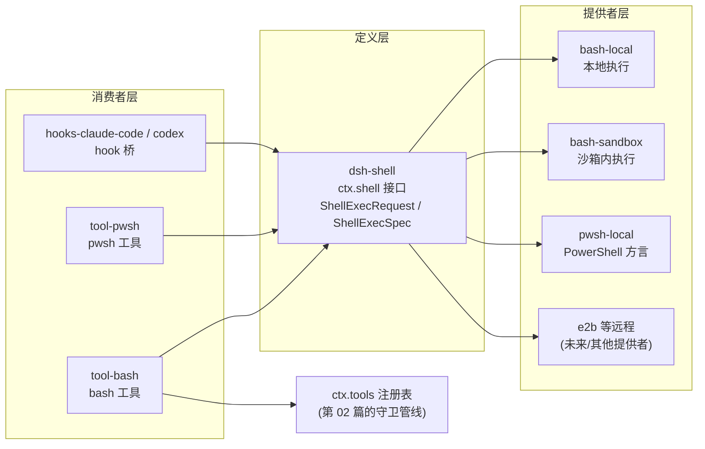

# 【第 03 篇】packages/shell/：能力缝——给 Agent 一双手

> 难度：🟡 进阶（建议先读第 01、02 篇）
> 前置阅读：`第01篇-vendor-Cordis框架层.md`、`第02篇-core产品主干.md`
> 对应目录：`deepseek-harness/packages/shell/`

## 目录

- [0 功能需求（WHY）](#0-功能需求why)
- [1 架构设计（WHAT）](#1-架构设计what)
- [2 实现落点（HOW）](#2-实现落点how)
- [3 产物演示（EXAMPLE）](#3-产物演示example)
- [4 动手验证](#4-动手验证🧪)
- [5 FAQ 与自测](#5-faq-与自测❓)
- [6 延伸阅读](#6-延伸阅读📚)

---

## 0 功能需求（WHY）

### 0.1 背景与场景

第 02 篇讲过：core 提供"工具注册表"骨架，但骨架不干活——**真正干活的工具来自各能力组**。`packages/shell/` 就是最典型、最常用、也最危险的一个：**给 Agent 一双手，让它真的能在机器上执行命令**。

三个典型场景：

1. **编码任务**：让 Agent"跑一下测试看看结果"——它需要执行 `pytest`，看到 stdout 才能继续；
2. **多环境部署**：同一产品要在本地裸机、CI 容器、远程沙箱三种环境跑——命令执行能力必须**同一套接口、三种实现**；
3. **危险边界**：模型可能执行任何命令——系统必须能限超时、限输出、控环境变量，未来还能套沙箱。

### 0.2 需求陈述

**R1 · 能力可插拔**——命令执行能力以"能力缝"形态存在：一个接口定义 + 多个可替换实现 + 若干消费者；换实现不改任何调用方。

- 实例：`ctx.shell` 是接口，`bash-local`（本地执行）与 `bash-sandbox`（沙箱内执行）是两种实现，模型工具 `bash` 是消费者——配置换一行，执行环境整体切换。
- 为什么必须：本地/沙箱/远程/Windows PowerShell 是同一能力的不同部署形态，不能为每种环境 fork 一套产品。

**R2 · 模型安全调用**——模型面对的**永远只是 schema 化的工具**（参数说明），而不是裸的进程 spawn；工具内部实现完全对模型隐藏。

- 实例：模型看到的是 `bash { command, description, run_in_background? }`，看不到 subprocess、spawn、pipe。
- 为什么必须：模型输出不可信；schema 是唯一入口，策略才能必达（呼应第 02 篇 R2）。

**R3 · 执行可管控**——每次执行都有明确边界：超时、stdout 捕获上限、环境变量白名单式管理、stdin 策略、取消信号。

- 实例：`timeoutMs` 到点杀进程；`stdoutMaxBytes` 超限截断；`DSH_*` 环境变量由宿主管理，子进程不得覆盖。
- 为什么必须：失控的命令 = 失控的机器；无界输出 = 塞爆上下文。

**R4 · 生态可扩展**——第三方可以注册新的执行器（如 `pwsh-local`），复用同一缝，无需改动消费者。

- 实例：`tool-pwsh` 与 `tool-bash` 结构完全镜像，只是方言不同；Windows 组合用 pwsh 后端即可。
- 为什么必须：能力缝的生命力在于"缝"本身可扩展，而不是内置多少个实现。

### 0.3 非功能需求

| 编号 | 约束 | 衡量方式 |
|---|---|---|
| N1 | **进程可控**：命令进程组可杀、可取消（signal 触发 kill） | 超时后无残留子进程 |
| N2 | **输出有界**：stdout/stderr 有捕获上限，超限截断 | 大输出不塞爆上下文 |
| N3 | **环境可信**：`DSH_*` 为宿主托管事实，子进程环境不得伪造/覆盖 | 子进程看到的 DSH_* 与宿主快照一致 |
| N4 | **边界显式**：request 可选字段必须经 `resolve()` 显式补全，禁止执行器内部偷偷默认 | `resolve()` 是调用与执行之间唯一桥梁 |
| N5 | **可审计**：每次执行有身份（callId）、有事件（tool/call → tool/result） | 会话日志可完整回放一次执行 |

### 0.4 验收标准

| 需求 | 验收示例（做到 = 通过） | 失败示例（做不到 = 没通过） |
|---|---|---|
| R1 | 配置把 `bash-local` 换成 `bash-sandbox`，工具/UI/钩子零改动 | 换实现要改消费者代码 |
| R2 | 模型只能按 schema 传参；恶意参数（如注入）被拒或安全执行 | 模型能触达进程层 API |
| R3 | `timeoutMs: 1000` 的命令 1 秒后被杀；百万行输出被截断 | 命令永挂；输出撑爆上下文 |
| R4 | 新增 `pwsh-local` 后端，`tool-pwsh` 直接可用 | 新后端要改工具层 |

### 0.5 边界与不做什么

- **不做持久会话**：跨调用保持 shell 状态的 PTY 属于 `packages/terminal/`（`terminal-bash`、`tool-terminal`）。
- **不做进程树底层**：spawn/kill/stdio 的机制属于 `packages/subprocess/`（`ctx.subprocess`）；shell 缝是它的上层消费者。
- **不做沙箱本身**：进程隔离属于 `packages/sandbox/`（`ctx.sandbox`）；`bash-sandbox` 只是"消费沙箱缝的执行器"。
- **不做凭据管理**：环境里的密钥走 `credentials` 组；shell 只负责"传递当前环境快照"。

### 0.6 设计哲学（原则 → 引出的需求）

| 原则 | 内容 | 引出的需求 |
|---|---|---|
| P1 能力缝三件套 | 任何可插拔能力 = Service Definition（接口）+ Provider（实现）+ Consumer（工具）；三件缺一不算能力缝 | R1/R4 |
| P2 explicit > implicit | 可选参数必须经 `resolve()` 显式补全为 spec，执行器不偷偷默认 | N4 |
| P3 模型只见 schema | 模型可见面与实现面严格分离，schema 永不泄漏实现细节 | R2 |
| P4 托管环境命名空间 | `DSH_*` 变量是宿主管辖的事实，先清洗再合并 | N3 |
| P5 执行即事件 | 一次执行 = 一对日志事件（tool/call → tool/result），可审计可回放 | N5 |

### 0.7 备选技术路径

| 路径 | 思路 | 优势 | 代价 | 需求匹配 |
|---|---|---|---|---|
| A. 裸 spawn 暴露 | 模型直接拿到 spawn 能力 | 实现最少 | 模型可见面 = 系统调用面，无 schema 无策略 | R2/R3 落空 |
| B. 单实现硬编码 | 产品内置一个 bash 执行器，写死 | 简单 | 本地/沙箱/远程无法切换；扩展要改内核 | R1/R4 落空 |
| C. 能力缝（**本项目**） | 接口 + 多提供者 + 消费者，全部插件化 | 换实现零改动、生态可扩展 | 多一层抽象；需要治理"缝"的语义 | 全面满足 R1~R4 |
| D. 统一远程执行层 | 所有执行走远端服务（类似 E2B 路线） | 安全与隔离最佳 | 本地场景延迟/断网不可用；仍需本地兜底 | 是 C 的一种提供者，不是替代 |

**选型结论**：需求要求"同一能力多形态部署 + 模型安全 + 生态扩展"（R1~R4）→ 只有 C（能力缝）同时满足；C 的抽象成本由"缝"的文档化治理对冲（官方 `capability-seams.md` 就是这份治理文档）。本地裸机用 `bash-local`、隔离环境用 `bash-sandbox`、云端用 E2B——**同一个 `ctx.shell`**。

## 1 架构设计（WHAT）

### 1.1 总体架构：缝的三件套

官方对能力缝的定义与 shell 缝的成员：

<div style="border-left:4px solid #0969da;background:#f6f8fa;padding:10px 14px;margin:12px 0;border-radius:0 6px 6px 0">
<b>📖 原文</b>（docs/subsystems/shell.md 第 5 行）：<i>"The bash execution seam is split across a Service Definition (dsh-shell, ctx.shell), Service Providers (dsh-bash-local and dsh-bash-sandbox), and Consumer (dsh-tool-bash, the bash schema)."</i><br/>
<span style="color:#57606a">出处：</span>
<a href="../../deepseek-harness/docs/subsystems/shell.md">本地打开</a> ·
<a href="https://github.com/deepseek-ai/deepseek-harness/blob/master/docs/subsystems/shell.md#L5">GitHub 查看（第 5 行）</a>
</div>



**三步读懂**：

1. **定义层**声明接口：`ShellExecRequest`（调用方请求，字段可选）与 `ShellExecSpec`（补全后的执行规格）；
2. **提供者层**实现接口：`bash-local` 直接 spawn、`bash-sandbox` 把命令交给 `ctx.sandbox` 包裹后 spawn——**消费者感知不到差异**（R1）；
3. **消费者层**把能力翻译成模型工具：`tool-bash` 注册进 `ctx.tools`，模型通过 schema 调用（R2）。

命令从模型到机器的完整链路：

<div style="display:flex;align-items:center;gap:6px;flex-wrap:wrap;margin:12px 0">
  <div style="border:1px solid #d0d7de;border-radius:6px;padding:6px 10px;background:#f6f8fa">模型调用 bash 工具<br/><span style="font-size:12px;color:#57606a">tool/call 事件</span></div>
  <span>→</span>
  <div style="border:1px solid #d0d7de;border-radius:6px;padding:6px 10px;background:#f6f8fa">ctx.tools 守卫管线<br/><span style="font-size:12px;color:#57606a">策略/超时/并发</span></div>
  <span>→</span>
  <div style="border:1px solid #d0d7de;border-radius:6px;padding:6px 10px;background:#f6f8fa">ctx.shell.resolve()<br/><span style="font-size:12px;color:#57606a">request → spec</span></div>
  <span>→</span>
  <div style="border:1px solid #0969da;border-radius:6px;padding:6px 10px;background:#e8f0fe">执行器 spawn<br/><span style="font-size:12px;color:#57606a">bash-local / bash-sandbox</span></div>
  <span>→</span>
  <div style="border:1px solid #d0d7de;border-radius:6px;padding:6px 10px;background:#f6f8fa">结果回写<br/><span style="font-size:12px;color:#57606a">tool/result 事件</span></div>
</div>

### 1.2 关键架构决策（需求 → 方案 → 权衡）

| # | 决策 | 对应需求 | 权衡 |
|---|---|---|---|
| D1 | **request/spec 分离**：`resolve()` 显式补全可选字段，执行器只吃 spec | N4 | 多一次调用；换来"显式 > 隐式"的边界纪律 |
| D2 | **DSH_* 托管环境**：宿主管辖的环境事实先清洗后合并，调用方 env 无法覆盖 | N3 | 环境变量来源变多；换来子进程环境可信 |
| D3 | **有界输出 + 超时**：stdoutMaxBytes / timeoutMs 由实现兜底封顶 | R3 / N2 | 大输出会截断；换来上下文不被撑爆 |
| D4 | **与 ctx.jobs 集成**：`run_in_background` 注册到通用任务运行时，用 `job_*` 工具收集 | R3 | 多一跳；换来前后台统一管控 |
| D5 | **sandbox 可选包裹**：`bash-sandbox` 消费 `ctx.sandbox`，未装沙箱的部署用 `bash-local` | R1 | 沙箱配置复杂度；换来部署形态自由切换 |

### 1.3 关系网

官方生成的缝表（[docs/capability-seams.md 第 448 行](../../deepseek-harness/docs/capability-seams.md)）：

> `ctx.shell` | `seam` | 定义：[`shell`](../packages/shell/shell) | 提供者：[`bash-local`](../packages/shell/bash-local)、[`bash-sandbox`](../packages/shell/bash-sandbox)、[`pwsh-local`](../packages/shell/pwsh-local) | 消费者：[`tool-bash`](../packages/shell/tool-bash)、[`tool-pwsh`](../packages/shell/tool-pwsh)、[`hooks-claude-code`](../packages/hooks/hooks-claude-code)、[`hooks-codex`](../packages/hooks/hooks-codex) | *"The model-facing shell tools and hook bridges consume this seam; sandboxed, remote, or PowerShell executors replace bash-local without touching them."*

- **上游**：执行器经 `ctx.subprocess` spawn 进程；`bash-sandbox` 额外消费 `ctx.sandbox` 与 `ctx.sandboxPolicy`；
- **下游**：`tool-bash`/`tool-pwsh` 注册进 `ctx.tools`；hook 桥用它执行 Claude Code/Codex 命令；`tool-bash` 的 `run_in_background` 注册进 `ctx.jobs`；
- **平级缝**：`ctx.terminals`（持久 PTY）、`ctx.subprocess`（进程树）——三者分工：一次性命令走 shell、持续会话走 terminal、裸进程走 subprocess。

## 2 实现落点（HOW）

### 2.1 文件导航表（按阅读顺序）

| 顺序 | 文件（点击直达） | 关注点 | 对应需求 |
|---|---|---|---|
| 1 | [packages/shell/shell/src/types.ts](../../deepseek-harness/packages/shell/shell/src/types.ts) | `ShellExecRequest`（第 24 行起）与 `ShellExecSpec`：接口定义 | R1 |
| 2 | [packages/shell/shell/src/index.ts](../../deepseek-harness/packages/shell/shell/src/index.ts) | `ShellExecutor` 服务类与 `resolve()` | N4 |
| 3 | [packages/shell/bash-local/src](../../deepseek-harness/packages/shell/bash-local/src) | 本地执行器：spawn + 输出有界 + 超时（对照实现） | R3 |
| 4 | [packages/shell/bash-sandbox/src](../../deepseek-harness/packages/shell/bash-sandbox/src) | 沙箱执行器：消费 `ctx.sandbox` 包裹 argv | R1 |
| 5 | [packages/shell/tool-bash/src](../../deepseek-harness/packages/shell/tool-bash/src) | `bash` 工具：schema + 消费 `ctx.shell` | R2 |
| 6 | [packages/shell/shell-env/src](../../deepseek-harness/packages/shell/shell-env/src) | `DSH_*` 托管环境注册表 | N3 |
| 7 | [docs/capability-seams.md](../../deepseek-harness/docs/capability-seams.md) | 全缝关系图与缝表（生成的权威数据） | R1/R4 |

### 2.2 关键实现片段

**片段 A：请求与规格的分界**（[shell/src/types.ts 第 17~26 行](../../deepseek-harness/packages/shell/shell/src/types.ts)）

```ts
interface ShellExecRequest {
  command: string
  workdir?: string | undefined
  timeoutMs?: number | undefined
  stdoutMaxBytes?: number | undefined
  signal?: AbortSignal | undefined
  stdin?: string | undefined
  env?: Record<string, string> | undefined
  dshEnv?: DshEnvironment | undefined
  sandboxPolicy?: SandboxExecutionPolicy | undefined
}
```

翻译：这是**模型/插件面**的请求形状——`command` 必填，其余全部可选（由 `resolve()` 从配置补全）。注意 `dshEnv` 与 `env` 是分开的：`env` 是普通环境项（先合并），`dshEnv` 是宿主管辖的 `DSH_*` 事实（**最后合并**，所以任何调用方都不能覆盖托管值，N3）。`stdin` 默认关闭——模型驱动的工具调用不喂 stdin（要用就写 heredoc）。

**片段 B：执行器的契约**（[shell/src/types.ts](../../deepseek-harness/packages/shell/shell/src/types.ts)，hover 查看完整 JSDoc）

```ts
interface ShellExecutor {
  resolve(request: ShellExecRequest): ShellExecSpec
  run(spec: ShellExecSpec, signal?: AbortSignal): Promise<ShellExecResult>
}
```

翻译：缝的完整接口就两个方法。`resolve` 把可选字段补全成 spec（N4 的落点）；`run` 执行并返回结果（stdout/stderr/exit code）。**消费者只依赖这两个方法**——`bash-local` 和 `bash-sandbox` 的差异全部封装在 `run` 内部（R1 的结构保证）。

**片段 C：模型看到的 bash 工具**（[docs/tool-catalog.md](../../deepseek-harness/docs/tool-catalog.md) 中 `@deepseek-ai/dsh-tool-bash` 条目，生成的真实目录）

> The bash tool is the model-facing consumer of the bash executor seam. A `run_in_background` run registers with the generic `ctx.jobs` runtime and is collected/stopped through the `job_*` tools; the `enableRunInBackground` config (default true) removes the parameter entirely when disabled.

翻译：工具目录对 bash 工具的官方描述——它是"模型面对的执行缝消费者"；`run_in_background` 参数走通用任务运行时。模型看到的就是 `bash { command, description, run_in_background? }` 这个 schema，看不到任何实现细节（R2）。

### 2.3 符号 hover 指引

在 VS Code 打开 [packages/shell/shell/src/types.ts](../../deepseek-harness/packages/shell/shell/src/types.ts)，hover `ShellExecRequest` 的每个字段可看官方 JSDoc（`stdin` 字段的注释解释了"为什么模型工具不暴露 stdin"）；打开 [packages/shell/tool-bash/src](../../deepseek-harness/packages/shell/tool-bash/src) 的 schema 文件可看工具定义。

## 3 产物演示（EXAMPLE）

### 3.1 输入

同一份真实快照（`examples/acp-agent/tests/snapshots/bash-tool-turn/session.jsonl`）中，模型发出的工具调用（[完整文件见此处](../../deepseek-harness/examples/acp-agent/tests/snapshots/bash-tool-turn/session.jsonl)）：

```json
{"type":"tool/call","seq":65,"data":{"callId":"call_00_fkbBRJsUrGKd1pWVc4Gn8233","name":"bash","arguments":"{\"command\": \"echo TERMINAL_OK\", \"description\": \"Echo TERMINAL_OK to verify terminal access\"}"}}
```

概念输入还包括执行器的组合配置（[examples/headless-agent/cordis.yml 第 35~41 行](../../deepseek-harness/examples/headless-agent/cordis.yml)）：

```yaml
- id: subprocess
  name: '@deepseek-ai/dsh-subprocess-local'
- id: bash
  name: '@deepseek-ai/dsh-bash-local'
  config:
    timeoutMs: 60000
```

### 3.2 产物（真实执行事件对）

> 以下为仓库现存快照 `session.jsonl` 的**逐字符拷贝**（行 65 与行 66）；行号与注释列为本文档添加。

<table style="border-collapse:collapse;width:100%;font-size:13px">
  <tr style="background:#f6f8fa">
    <th style="border:1px solid #d0d7de;padding:5px 8px;width:36px">行</th>
    <th style="border:1px solid #d0d7de;padding:5px 8px">真实产物（JSONL）</th>
    <th style="border:1px solid #d0d7de;padding:5px 8px">行内注释</th>
  </tr>
  <tr style="background:#fff8c5">
    <td style="border:1px solid #d0d7de;padding:5px 8px;text-align:center;color:#57606a">1</td>
    <td style="border:1px solid #d0d7de;padding:5px 8px;font-family:monospace">{"type":"tool/call","seq":65,"time":1785730424646,"data":{"turn":1,"step":1,"callId":"call_00_fkbBRJsUrGKd1pWVc4Gn8233","name":"bash","arguments":"{\"command\": \"echo TERMINAL_OK\", \"description\": \"Echo TERMINAL_OK to verify terminal access\"}"}}</td>
    <td style="border:1px solid #d0d7de;padding:5px 8px"><b>🎯 调用落账</b>：模型按 schema 传参（R2），callId 建立审计身份（N5）</td>
  </tr>
  <tr>
    <td style="border:1px solid #d0d7de;padding:5px 8px;text-align:center;color:#57606a">2</td>
    <td style="border:1px solid #d0d7de;padding:5px 8px;font-family:monospace">{"type":"tool/result","seq":66,"time":1785730424665,"data":{"turn":1,"step":1,"message":{"source":{"kind":"tool","callId":"call_00_fkbBRJsUrGKd1pWVc4Gn8233"},"content":[{"type":"tool-result","toolCallId":"call_00_fkbBRJsUrGKd1pWVc4Gn8233","content":[{"type":"text","text":"TERMINAL_OK\n"}],"isError":false}],"role":"user","id":"908ca4f5-efbb-443b-9b07-acbf25edf954"}},"sourceEventSeqs":[65],"surfaceOp":"append"}}</td>
    <td style="border:1px solid #d0d7de;padding:5px 8px"><b>🎯 结果回写</b>：stdout="TERMINAL_OK\n"，isError=false；<code>sourceEventSeqs:[65]</code> 指回调用事件（N5 血缘）</td>
  </tr>
</table>

配套产物——工具目录中的 bash 条目（[tool-catalog.md](../../deepseek-harness/docs/tool-catalog.md) 第 21 行起，生成的真实目录）：

> | `@deepseek-ai/dsh-tool-bash` | `bash` | `ctx.tools`, `ctx.shell`, `ctx.systemPrompt`, `ctx.shellEnv`, `ctx.jobs at call time for run_in_background` | `tool/call`, `tool/result` | - | *The bash tool is the model-facing consumer of the bash executor seam…* |

### 3.3 发生了什么（模型调用 → 机器执行 → 结果回写的六步）

1. 模型在 step 1 里发出工具调用（产物行 1），参数完全符合 schema（R2）；
2. `ctx.tools` 守卫管线放行后，`tool-bash` 构造 `ShellExecRequest`（command="echo TERMINAL_OK"）；
3. `ctx.shell.resolve()` 补全 spec：workdir、timeoutMs（组合配置里 60000）、输出上限（N4）；
4. `bash-local` 经 `ctx.subprocess` spawn 进程，捕获 stdout，命令完成；
5. 执行器返回结果，`tool-bash` 把 stdout 包成 tool-result 内容回写日志（产物行 2）；
6. 结果作为 user-role 消息进入模型历史（`sourceEventSeqs:[65]` 记录血缘）——模型看到输出后进入 step 2 输出 DONE。

### 3.4 观察点（对应产物表中的行号）

- **行 1 与行 2 成对**：一次执行 = 一对事件，callId 贯穿（N5 可审计）；
- **行 2 的 `isError:false`**：成功标志；失败时会带 stderr 与错误信息（R3 可诊断）；
- **行 2 的 `sourceEventSeqs:[65]`**：结果显式指回调用事件——事件血缘（R1 派生体系的一部分）；
- **配置行 2（cordis.yml）**：`timeoutMs: 60000` 就是 `resolve()` 补全 spec 时用的默认值来源。

## 4 动手验证（🧪）

> 以下命令已在本机实测（仓库根目录 `deepseek-harness\deepseek-harness` 下执行）。

### 任务 1：在工具目录里找到 bash 的"官方名片"

```powershell
Select-String -Path "docs\tool-catalog.md" -Pattern "dsh-tool-bash" | Select-Object -First 1
```

**预期**：命中一行，包含 `bash` 工具名、依赖的四个服务（ctx.tools / ctx.shell / ctx.systemPrompt / ctx.shellEnv）与事件（tool/call、tool/result）。**判据**：看到 `ctx.shell` 出现在依赖列——证明 bash 工具是缝的消费者。

### 任务 2：读接口定义

打开 [packages/shell/shell/src/types.ts](../../deepseek-harness/packages/shell/shell/src/types.ts)，回答：`ShellExecRequest` 里哪些字段可选？`stdin` 字段的 JSDoc 说了什么？（答案：除 command 外全部可选；stdin 默认关闭，模型工具不暴露它，要用写 heredoc。）

### 任务 3（进阶）：对比两种执行器

```powershell
Get-ChildItem "packages\shell\bash-local\src", "packages\shell\bash-sandbox\src" -Recurse -File |
  Select-Object FullName
```

**预期**：两个目录结构相似（都有 index.ts 与执行实现）。**判据**：对比二者的 `run` 实现——`bash-sandbox` 里应出现对 `ctx.sandbox` 的调用（把 argv 交给沙箱包裹），`bash-local` 没有——这就是"同一个接口、两种实现"的微观证据。

## 5 FAQ 与自测（❓）

### FAQ

- **Q1：能力缝三件套到底是什么？** Service Definition（接口，如 `ctx.shell`）+ Service Provider（实现，如 bash-local）+ Consumer（使用者，如 tool-bash）。三者缺一就不是"缝"——只定义接口没有实现 = 空谈，只有实现没有消费者 = 没人用。
- **Q2：为什么要有 request/spec 分离？** 因为"显式 > 隐式"：可选参数（workdir/timeout）不该由执行器内部偷偷决定，必须 `resolve()` 显式补全——这样配置来源、默认值、封顶规则都有唯一落点（N4）。
- **Q3：bash 工具和 terminal 工具什么区别？** bash 是一次性命令（每次新进程，无状态）；terminal 是持久 PTY 会话（状态保留、可交互）。对应两个不同的缝：`ctx.shell` vs `ctx.terminals`。
- **Q4：`DSH_*` 环境变量是干嘛的？** 宿主托管的事实（cwd、会话信息等），先清洗掉子进程继承的旧值再合并托管快照——防止"子进程环境里混入宿主残留"（N3）。
- **Q5：怎么给 dsh 加一种新 shell？** 实现 `ShellExecutor` 接口（resolve + run），挂到 `ctx.shell`，再配一个模型工具（参考 tool-pwsh 镜像 tool-bash）——消费者零改动（R4）。

### 自测（答案折叠在下方）

1. 能力缝三件套分别对应 shell 组里的哪三个包？
2. `resolve()` 存在的意义是什么？
3. 产物表里哪个字段证明"结果指回调用"？
4. `bash-sandbox` 与 `bash-local` 的差异封装在哪个方法内部？
5. 下列哪个不属于 shell 组的职责？A. 一次性命令执行 B. 持久 PTY 会话 C. 沙箱包裹执行 D. PowerShell 方言执行

<details>
<summary>点开看答案</summary>

1. 定义：`dsh-shell`；提供者：`dsh-bash-local` / `dsh-bash-sandbox` / `dsh-pwsh-local`；消费者：`dsh-tool-bash` / `dsh-tool-pwsh`。
2. 把可选的 request 补全成确定的 spec（workdir/timeout/上限），让"显式 > 隐式"有唯一落点（N4）。
3. `sourceEventSeqs: [65]`——结果事件显式指回调用事件。
4. `run` 方法内部——消费者只依赖 `resolve` + `run` 两个方法（R1 的结构保证）。
5. B。持久 PTY 会话属于 `packages/terminal/`。

</details>

## 6 延伸阅读（📚）

**官方（权威来源）**：

- [docs/subsystems/shell.md](../../deepseek-harness/docs/subsystems/shell.md) —— 缝的完整契约（ShellExecSpec 全字段、环境命名空间）
- [docs/capability-seams.md](../../deepseek-harness/docs/capability-seams.md) —— 全部能力缝的生成式关系图与缝表
- [docs/subsystems/subprocess.md](../../deepseek-harness/docs/subsystems/subprocess.md) —— 进程树底层（shell 缝的下游）
- [docs/subsystems/sandbox.md](../../deepseek-harness/docs/subsystems/sandbox.md) —— 沙箱缝（bash-sandbox 消费的接口）
- [docs/tool-catalog.md](../../deepseek-harness/docs/tool-catalog.md) —— 全部模型工具的生成式目录（bash 条目见第 21 行附近）

**决策记录（WHY 的一手来源）**：

- 🔴 [.agents/notes/implemented/architecture/2026-06-13-capability-seams.md](../../deepseek-harness/.agents/notes/implemented/architecture/2026-06-13-capability-seams.md) —— 能力缝概念的诞生决策

**外部文献（按难度递增）**：

- 🟢 [Martin Fowler: Strangler Fig Application](https://martinfowler.com/bliki/StranglerFigApplication.html) —— "可替换实现"思想的经典模式（缝的远亲）
- 🟡 [12-Factor: Config](https://12factor.net/config) —— 环境变量管理哲学（DSH_* 命名空间的参照系）
- 🔴 [Google SRE: 进程与沙箱隔离](https://sre.google/sre-book/being-on-call/) —— 为什么命令执行必须可管控、可审计

---

**下一篇预告**：【第 04 篇】`packages/llm/`——模型适配缝与消息词汇（后续按路线图推进）。
