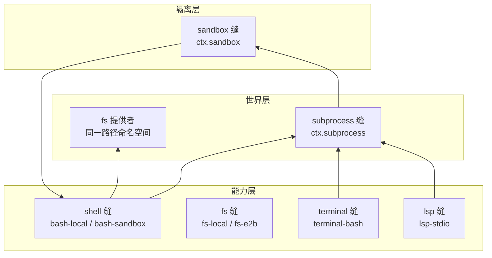

# 【第 05 篇】执行世界：fs / subprocess / sandbox——Agent 的"手脚"家族

> 难度：🟡 进阶（建议先读第 02、03 篇）
> 前置阅读：`第03篇-shell能力缝.md`
> 对应目录：`deepseek-harness/packages/fs/`、`deepseek-harness/packages/subprocess/`、`deepseek-harness/packages/sandbox/`

## 目录

- [0 功能需求（WHY）](#0-功能需求why)
- [1 架构设计（WHAT）](#1-架构设计what)
- [2 实现落点（HOW）](#2-实现落点how)
- [3 产物演示（EXAMPLE）](#3-产物演示example)
- [4 动手验证](#4-动手验证🧪)
- [5 FAQ 与自测](#5-faq-与自测❓)
- [6 延伸阅读](#6-延伸阅读📚)

---

## 0 功能需求（WHY）

### 0.1 背景与场景

第 03 篇的 shell 缝给 Agent 一双手；但手要落在**真实世界**上，还需要三个基础设施：**文件**（读写什么）、**进程**（怎么启动）、**隔离**（能碰什么）。这三个能力组共享一个核心假设——**同一个"执行世界"**：文件提供者与进程提供者指向同一套路径与进程命名空间。官方对这一点有明确表述（[docs/architecture.md 第 102 行](../deepseek-harness/docs/architecture.md)）：

<div style="border-left:4px solid #0969da;background:#f6f8fa;padding:10px 14px;margin:12px 0;border-radius:0 6px 6px 0">
<b>📖 原文</b>：<i>"Filesystem and subprocess providers share one execution world, so pointing them at a remote sandbox moves Bash, PTY, and LSP with them, with no provider forks."</i><br/>
<span style="color:#57606a">出处：</span>
<a href="../../deepseek-harness/docs/architecture.md">本地打开</a> ·
<a href="https://github.com/deepseek-ai/deepseek-harness/blob/master/docs/architecture.md#L102">GitHub 查看（第 102 行）</a>
</div>

三个典型场景：

1. **修改文件**：模型要"把 settings.txt 里的 blue 改成 green"——但它可能没读过这个文件就乱改；
2. **跑进程**：模型执行 `pytest`——进程的环境里可能残留宿主秘密、输出可能无限大；
3. **隔离执行**：同一产品在裸机（不隔离）、CI（部分隔离）、云端（强隔离）三种环境跑——隔离策略必须可配置、且**如实报告自己的完成度**。

### 0.2 需求陈述

**R1 · 文件操作有界可审计（fs）**——文件操作以**不透明目标身份**（`FsTarget`）进行；写/编辑受"观察策略"约束（先读后写），操作全程有事件。

- 实例：模型直接 edit 未读过的文件 → 被拒，错误码 `FS_NOT_OBSERVED`（见第 3 节真实产物）。
- 为什么必须：模型输出不可信；"先读后写"是最小的数据卫生规则。

**R2 · 进程启动统一受控（subprocess）**——所有子进程经 `ctx.subprocess` 启动：环境经凭据清洗 + `DSH_*` 托管命名空间重建，输出有界（`CollectedOutput` 报告截断与 spill）。

- 实例：`DSH_*` 变量先丢弃环境残留再合并托管快照；输出超限取尾部并 spill 到文件。
- 为什么必须：子进程环境 = 秘密泄漏面；无界输出 = 上下文炸弹。

**R3 · 隔离可配置且如实报告（sandbox）**——三种 `SandboxMode`（read-only / workspace-write / danger-full-access），且强制执行度如实报告（`full` / `partial`），消费者不得把 partial 当 full。

- 实例：Windows ACL 后端与旧版 Landlock ABI 是当前的 partial 案例（[sandbox.md 第 30 行](../deepseek-harness/docs/subsystems/sandbox.md)）。
- 为什么必须：隔离是安全承诺；承诺必须可验证，不能静默降级。

**R4 · 世界可整体切换**——文件、进程、shell 提供者共享同一执行世界；切换提供者（本地 → 沙箱 → 远程），Bash/PTY/LSP 全部跟随，无提供者分叉。

- 实例：`bash-sandbox` 消费 `ctx.sandbox` 后，模型看到的工具 schema 不变（第 03 篇 R1 的延伸）。
- 为什么必须：部署形态千差万别；"世界"必须是可整体替换的单元。

### 0.3 非功能需求

| 编号 | 约束 | 衡量方式 |
|---|---|---|
| N1 | **身份不透明**：`FsTargetKey` 是 branded opaque id，消费者不得解析、不得假设它是本地绝对路径 | 换远程后端消费者零改动 |
| N2 | **原子文本操作**：写/编辑是原子文本操作，可配 stale 守卫（文件版本 token） | 并发修改不产生半成品 |
| N3 | **输出有界**：每个收集流报告 `truncated` 与 `spillPath`（完整内容落盘路径） | 大输出不撑爆上下文，且不丢数据 |
| N4 | **环境可信**：先丢弃环境残留 `DSH_*`，再合并显式条目与托管快照 | 子进程看到的事实与宿主一致 |
| N5 | **强制如实**：`SandboxEnforcement` 报告 full/partial，partial 不得被当作 full | 要求绝对边界者显式拒绝 partial |

### 0.4 验收标准

| 需求 | 验收示例（做到 = 通过） | 失败示例（做不到 = 没通过） |
|---|---|---|
| R1 | 模型未读先写被拒（FS_NOT_OBSERVED）；先读后写成功 | 模型可以盲改任意文件 |
| R2 | 子进程环境无宿主残留 DSH_*；百万行输出截断且 spill 可查 | 子进程继承宿主秘密；输出撑爆上下文 |
| R3 | workspace-write 模式下写工作区成功、写外部被拒；partial 环境显式报 partial | 隔离静默降级 |
| R4 | 切换 fs/subprocess 提供者到远程沙箱，shell/terminal/lsp 全部跟随 | 每个能力各自适配远程 |

### 0.5 边界与不做什么

- **不做 shell 语义**：命令解析、超时策略属于 `shell` 组（第 03 篇）；subprocess 只提供"启动进程"的机制。
- **不做持久终端**：PTY 会话属于 `terminal` 组（消费 subprocess 的 terminal 原语）。
- **sandbox 只管文件效果**：网络与进程可见性不在 `SandboxMode` 词汇内（[sandbox.md 第 11 行](../deepseek-harness/docs/subsystems/sandbox.md)）。
- **不做凭据存储**：环境里的密钥来自 `credentials` 组；subprocess 负责"清洗"而非"保管"。

### 0.6 设计哲学（原则 → 引出的需求）

| 原则 | 内容 | 引出的需求 |
|---|---|---|
| P1 不透明身份 | 跨能力坐标（路径、目标）用 branded id，消费者不解读 | R1 / N1 |
| P2 策略经事件 | 文件策略（read-before-write）通过 `fs/*` 事件生效，不是写死在工具里 | R1 |
| P3 清洗再合并 | 子进程环境 = 丢弃残留 → 显式条目 → 托管快照，顺序即安全 | R2 / N4 |
| P4 承诺要可验证 | 隔离模式与强制完成度分开报告，partial 显式暴露 | R3 / N5 |
| P5 世界共享 | 文件/进程/shell 提供者共享执行世界，整体切换 | R4 |

### 0.7 备选技术路径

| 路径 | 思路 | 优势 | 代价 | 需求匹配 |
|---|---|---|---|---|
| A. 裸 fs 调用 | 工具直接操作文件路径字符串 | 实现最少 | 无身份抽象、无策略挂点、换远程后端要改工具 | R1 落空 |
| B. 无隔离 | 子进程裸跑 | 最快 | 命令即全权；多环境无法部署 | R3/R4 落空 |
| C. 三缝 + 世界共享（**本项目**） | fs/subprocess 缝 + sandbox 缝 + 同世界假设 | 整体切换、策略可挂、隔离可配置 | 三个缝要协调治理 | 全面满足 R1~R4 |
| D. 全远程执行（E2B 路线） | 一切执行走云端沙箱 | 安全与隔离最强 | 本地/离线不可用 | 是 C 的一种提供者，不是替代 |

**选型结论**：需求要求"有界、可信、可切换、可验证"（R1~R4）→ 三缝 + 世界共享（C）是唯一同时满足的路线；"世界共享"是关键决策——它让"换提供者"变成"换世界"，而不是逐能力适配（R4）。

## 1 架构设计（WHAT）

### 1.1 总体架构：一个执行世界，三个缝



**四步读懂**：

1. **世界层**：`ctx.subprocess` 与 fs 提供者共享同一路径/进程命名空间（P5）——bash 里 spawn 的进程能打开 fs 里 `processPath(target)` 返回的真实路径；
2. **能力层**：shell / terminal / lsp 都经 subprocess 启动进程；bash-sandbox 额外把自己的 argv 交给 sandbox 缝包裹（第 03 篇 D5）；
3. **隔离层**：`ctx.sandbox` 是"包裹 argv"的缝——消费者把将要 spawn 的精确 argv 交给它，由后端（bwrap/Landlock/Seatbelt/Windows ACL）按 per-call 策略包裹（R3）；
4. **切换即换世界**：把世界层提供者指向远程沙箱，Bash、PTY、LSP、fs 全部跟随（R4）。

### 1.2 关键架构决策（需求 → 方案 → 权衡）

| # | 决策 | 对应需求 | 权衡 |
|---|---|---|---|
| D1 | **FsTarget 不透明身份**：resolve() 先于一切操作，targetKey branded、displayPath 仅展示 | R1 / N1 | 本地路径无法直接字符串拼接；换来远程后端可插 |
| D2 | **观察策略经事件**：read-before-write 是 `fs/*` 事件门插件，工具不调用策略方法 | R1 | 不带策略插件 = 无约束缝（部署方自选）；换来策略可换可摘 |
| D3 | **DSH_* 托管命名空间**：先丢弃再合并，显式 undefined 作 tombstone | R2 / N4 | 环境来源多；换来子进程环境可信 |
| D4 | **SandboxMode + Enforcement 分离**：模式是请求、enforcement 是报告 | R3 / N5 | 消费者要处理 partial；换来承诺可验证 |
| D5 | **danger-full-access 绕过**：全权消费者直接 spawn 原 argv，不调 ctx.sandbox | R3 | 模式词汇混入"不隔离"；换来策略解析一次完成 |

### 1.3 关系网

- **上游**：shell/terminal/lsp 缝消费 subprocess；`bash-sandbox`/`pwsh-sandbox` 消费 sandbox 缝；sandbox-local 的 Linux 后端使用 bwrap/Landlock（native/landlock-run 是 Landlock 后端的原生模块来源）；
- **下游**：subprocess 消费 fs 提供者做 `processPath` 转换；`fs-local` 的 cwd 来自会话（`!!js process.cwd()`，见 [examples/headless-agent/cordis.yml 第 156~159 行](../deepseek-harness/examples/headless-agent/cordis.yml)）；
- **平级**：`fs-observation-policy` 与 `sandbox-policy` 都是"策略门"插件——前者管文件观察，后者管隔离默认模式与工作区根。

## 2 实现落点（HOW）

### 2.1 文件导航表（按阅读顺序）

| 顺序 | 文件（点击直达） | 关注点 | 对应需求 |
|---|---|---|---|
| 1 | [packages/fs/fs/src/types.ts](../deepseek-harness/packages/fs/fs/src/types.ts) | `FsTarget` / `FsTargetKey`（第 17~42 行） | R1 / N1 |
| 2 | [packages/fs/fs-observation-policy/src/types.ts](../deepseek-harness/packages/fs/fs-observation-policy/src/types.ts) | 观察策略的 `fs/*` 事件语义 | R1 |
| 3 | [packages/subprocess/subprocess/src/types.ts](../deepseek-harness/packages/subprocess/subprocess/src/types.ts) | `DshEnvironment` / `CollectedOutput`（第 17~37 行） | R2 / N3 / N4 |
| 4 | [packages/sandbox/sandbox/src/index.ts](../deepseek-harness/packages/sandbox/sandbox/src/index.ts) | `SandboxMode` / `SandboxEnforcement` | R3 |
| 5 | [packages/sandbox/sandbox-local/src](../deepseek-harness/packages/sandbox/sandbox-local/src) | 各平台后端（bwrap/Landlock/Seatbelt/Windows ACL） | R3 |
| 6 | [native/landlock-run](../deepseek-harness/native/landlock-run) | Landlock 原生模块（Linux 后端的一部分） | R3 |

### 2.2 关键实现片段

**片段 A：文件目标身份**（[fs/src/types.ts 第 17~31 行](../deepseek-harness/packages/fs/fs/src/types.ts)）

```ts
interface FsTarget {
  targetKey: FsTargetKey
  displayPath: string
}
```

翻译：一次路径解析（`resolve()`）产生一个**不透明目标**：`targetKey` 是 branded id（本地后端是 realpath 式字符串，远程后端可能是 URI 或 file id——**消费者禁止解析它**，N1）；`displayPath` 仅供模型/UI 展示，可能是相对路径或远程 URI。官方注释明确：*"Consumers MUST NOT parse it or assume it is a local absolute path"*（第 39~40 行）。想拿到子进程能打开的真实路径？用提供者的 `processPath(target)`——**跨能力坐标由提供者翻译，不由消费者猜**（P1）。

**片段 B：子进程环境的清洗顺序**（[subprocess/src/types.ts 第 15 行](../deepseek-harness/packages/subprocess/subprocess/src/types.ts)）

```ts
type DshEnvironmentKey = `${typeof DSH_ENV_PREFIX}${string}`
```

翻译：`DSH_*` 前缀的类型级约束——**环境键必须是模板字面量类型**，普通字符串写不进来（N4 在类型层面就拦住了）。官方语义（[subprocess.md 第 15 行](../deepseek-harness/docs/subsystems/subprocess.md)）：实现先**丢弃**环境残留的 `DSH_*` 名字，再合并调用方显式条目与托管快照——"当前事实只以显式字符串到达"。

**片段 C：捕获输出的边界**（[subprocess/src/types.ts 第 28~36 行](../deepseek-harness/packages/subprocess/subprocess/src/types.ts)）

```ts
interface CollectedOutput {
  text: string
  truncated: boolean
  spillPath?: string
}
```

翻译：每个收集流三件套：`text` 是被截断后的**尾部**；`truncated` 如实报告丢了多少（布尔）；`spillPath` 指向**完整**内容落盘的文件（截断且可落盘时）。这就是"上下文不被撑爆、数据不丢"的结构保证（N3）——模型看到的永远是尾部，想要全文去 spill 文件里找。

### 2.3 符号 hover 指引

在 VS Code 打开 [packages/fs/fs/src/types.ts](../deepseek-harness/packages/fs/fs/src/types.ts) hover `FsTarget`；打开 [packages/sandbox/sandbox/src/index.ts](../deepseek-harness/packages/sandbox/sandbox/src/index.ts) hover `SandboxMode` 与 `SandboxEnforcement` 查看官方 JSDoc（含 partial 案例说明）。

## 3 产物演示（EXAMPLE）

### 3.1 输入

真实快照 `examples/acp-agent/tests/snapshots/fs-policy-reject/session.jsonl`（[完整文件见此处](../deepseek-harness/examples/acp-agent/tests/snapshots/fs-policy-reject/session.jsonl)）中，模型**第一次**尝试修改文件（未先读）：

```json
{"type":"tool/call","seq":82,"data":{"callId":"call_00_x0zlnXl5JOxLrAYL9y7P0119","name":"edit","arguments":"{\"file_path\": \"settings.txt\", \"old_string\": \"blue\", \"new_string\": \"green\"}"}}
```

### 3.2 产物（真实策略拒绝与成功重试）

> 以下为仓库现存快照的**逐字符拷贝**（seq 82~150 节选）；行号与注释列为本文档添加。

<table style="border-collapse:collapse;width:100%;font-size:13px">
  <tr style="background:#f6f8fa">
    <th style="border:1px solid #d0d7de;padding:5px 8px;width:36px">行</th>
    <th style="border:1px solid #d0d7de;padding:5px 8px">真实产物（JSONL）</th>
    <th style="border:1px solid #d0d7de;padding:5px 8px">行内注释</th>
  </tr>
  <tr>
    <td style="border:1px solid #d0d7de;padding:5px 8px;text-align:center;color:#57606a">1</td>
    <td style="border:1px solid #d0d7de;padding:5px 8px;font-family:monospace">{"type":"tool/call","seq":82,…"name":"edit","arguments":"{\"file_path\": \"settings.txt\", \"old_string\": \"blue\", \"new_string\": \"green\"}"}</td>
    <td style="border:1px solid #d0d7de;padding:5px 8px">模型直接尝试 edit（<b>未先读</b>该文件）</td>
  </tr>
  <tr style="background:#fff8c5">
    <td style="border:1px solid #d0d7de;padding:5px 8px;text-align:center;color:#57606a">2</td>
    <td style="border:1px solid #d0d7de;padding:5px 8px;font-family:monospace">{"type":"tool/result","seq":83,…"text":"Error: edit requires reading \"{{cwd}}/settings.txt\" first — read the file, then retry","isError":true}…"error":{"name":"FsError","code":"FS_NOT_OBSERVED"}}</td>
    <td style="border:1px solid #d0d7de;padding:5px 8px"><b>🎯 策略拒绝</b>：isError=true、错误码 FS_NOT_OBSERVED——read-before-write 生效（R1）</td>
  </tr>
  <tr>
    <td style="border:1px solid #d0d7de;padding:5px 8px;text-align:center;color:#57606a">3</td>
    <td style="border:1px solid #d0d7de;padding:5px 8px;font-family:monospace">{"type":"tool/call","seq":149,…"name":"read","arguments":"{\"file_path\": \"settings.txt\"}"}</td>
    <td style="border:1px solid #d0d7de;padding:5px 8px">模型遵循提示先 read（step 2）</td>
  </tr>
  <tr>
    <td style="border:1px solid #d0d7de;padding:5px 8px;text-align:center;color:#57606a">4</td>
    <td style="border:1px solid #d0d7de;padding:5px 8px;font-family:monospace">{"type":"tool/result","seq":150,…"content":"<path>{{cwd}}/settings.txt</path>\n<type>file</type>\n<content>\n1: color: blue…","isError":false,…"meta":{"path":"{{cwd}}/settings.txt","offset":1,"lines":[{"number":1,…}]}}</td>
    <td style="border:1px solid #d0d7de;padding:5px 8px">read 成功：带行号渲染 + <code>meta.lines</code> 供后续编辑定位（N2 原子编辑的输入）</td>
  </tr>
</table>

### 3.3 发生了什么（模型盲改 → 被拒 → 先读 → 再改的四步）

1. 模型直接调用 `edit`（行 1），参数里有 old_string/new_string——它**假设**文件内容是 blue；
2. `fs-observation-policy` 在 `fs/*` 事件门上发现该文件从未被观察 → 拒绝（行 2），错误码 `FS_NOT_OBSERVED`，并在错误文本里给出可操作指引（"read the file, then retry"）；
3. 模型按指引先 `read`（行 3），返回带行号的真实内容（行 4）——blue 确实在第 1 行；
4. 模型随后带着"已观察"状态重试 edit，成功（快照中第三个 tool/call 之后是成功的 tool/result）。

### 3.4 观察点（对应产物表中的行号）

- **行 2 的 `"error":{"code":"FS_NOT_OBSERVED"}`**：策略拒绝有**稳定错误码**——模型与 UI 都能据此做出不同反应（R1 可编程性）；
- **行 2 的 `isError:true`**：与第 03 篇的 `isError:false` 形成对照——成功与失败都走同一事件对（N5 审计）；
- **行 4 的 `meta.lines`**：read 附带行号元数据——编辑工具据此定位 old_string，原子替换（N2）的输入就绪；
- **行 1~4 的 seq 连续**：拒绝-重试的完整过程全部落账（可回放，呼应第 02 篇 R1）。

## 4 动手验证（🧪）

> 以下命令已在本机实测（仓库根目录 `deepseek-harness\deepseek-harness` 下执行）。

### 任务 1：亲手复现"策略拒绝"证据

```powershell
Select-String -Path "examples\acp-agent\tests\snapshots\fs-policy-reject\session.jsonl" -Pattern 'FS_NOT_OBSERVED'
```

**预期**：命中一行（tool/result 事件）。**判据**：对照第 3.2 节行 2——错误文本包含 "read the file, then retry"。

### 任务 2：读三种隔离模式

打开 [packages/sandbox/sandbox/src/index.ts](../deepseek-harness/packages/sandbox/sandbox/src/index.ts)，找到 `SandboxMode`，回答：三种模式分别允许什么？（答案：read-only 只读 + 必要 sink；workspace-write 加工作区与后端临时区；danger-full-access 绕过全部限制。）

### 任务 3（进阶）：看策略插件的"门"

```powershell
Get-ChildItem "packages\fs\fs-observation-policy\src" -Recurse -File | Select-Object Name
```

**预期**：看到策略实现文件。**判据**：官方文档（[filesystem.md 第 7 行](../deepseek-harness/docs/subsystems/filesystem.md)）确认——*"The policy plugin changes these operations by deciding the `fs/*` waterfalls"*：策略是**事件门**，不是工具内部的 if（P2）。

## 5 FAQ 与自测（❓）

### FAQ

- **Q1：`FsTargetKey` 为什么禁止解析？** 因为本地后端它是路径字符串，远程后端可能是 URI 或 file id（N1）。消费者解析它 = 假设后端是本地 = 换远程就炸。需要真实路径请用 `processPath(target)`——由提供者翻译。
- **Q2：read-before-write 是写死在工具里的吗？** 不是。它是 `fs-observation-policy` 这个**可选插件**通过 `fs/*` 事件门实现的（P2）。不带这个插件，fs 缝就是无约束的（官方文档明确说明）；部署方预期会带（[filesystem.md 第 7 行](../deepseek-harness/docs/subsystems/filesystem.md)）。
- **Q3：SandboxMode 只管文件效果？** 对。网络与进程可见性**不在词汇内**（[sandbox.md 第 11 行](../deepseek-harness/docs/subsystems/sandbox.md)）——它是"文件效果策略"，不是完整沙箱。
- **Q4：partial enforcement 是什么意思？** 后端或内核 ABI 只能保证模式承诺的一部分文件效果（如旧 Landlock、Windows ACL 的 Everyone 边界）。要求绝对边界的消费者必须显式处理 partial，不能当 full 用（N5）。
- **Q5：执行世界和沙箱什么关系？** 世界 = 文件+进程的统一命名空间（R4）；沙箱 = 包裹这个世界里"进程的文件效果"的缝（R3）。沙箱是世界之上的策略层，不是另一个世界。

### 自测（答案折叠在下方）

1. `FsTarget` 的两个字段分别是什么？消费者可以解析哪个？
2. read-before-write 策略通过什么机制生效？
3. `CollectedOutput` 的 `spillPath` 什么时候出现？
4. `SandboxEnforcement` 的两种取值是什么？partial 意味着什么？
5. 下列哪个不属于本组的职责？A. 文件观察策略 B. 进程启动 C. 命令解析与超时 D. 进程隔离

<details>
<summary>点开看答案</summary>

1. `targetKey`（branded opaque，禁止解析）与 `displayPath`（仅展示）。
2. `fs/*` 事件门（fs-observation-policy 插件），不是工具内部的 if。
3. 输出被截断**且**完整内容可落盘时（N3）。
4. `full` / `partial`。partial = 后端或内核 ABI 无法保证模式承诺的全部文件效果。
5. C。命令解析与超时属于 `shell` 组。

</details>

## 6 延伸阅读（📚）

**官方（权威来源）**：

- [docs/subsystems/filesystem.md](../deepseek-harness/docs/subsystems/filesystem.md) —— fs 缝四部件与观察策略（495 行）
- [docs/subsystems/subprocess.md](../deepseek-harness/docs/subsystems/subprocess.md) —— 进程缝、环境命名空间、stdio 布局（324 行）
- [docs/subsystems/sandbox.md](../deepseek-harness/docs/subsystems/sandbox.md) —— 模式与强制语义（218 行）
- [docs/architecture.md](../deepseek-harness/docs/architecture.md) —— "Capability seams" 一节（世界共享论点）

**外部文献（按难度递增）**：

- 🟢 [bubblewrap 文档](https://github.com/containers/bubblewrap) —— Linux 沙箱后端之一
- 🟡 [Landlock LSM 内核文档](https://docs.kernel.org/userspace-api/landlock.html) —— 无特权用户沙箱机制（native/landlock-run 的基础）
- 🔴 [Windows Restricted Tokens](https://learn.microsoft.com/en-us/windows/win32/secauthz/restricted-tokens) —— Windows ACL 后端的机制参照

---

**下一篇预告**：【第 06 篇】记忆的落地：session 持久化 / session-query / compaction。
