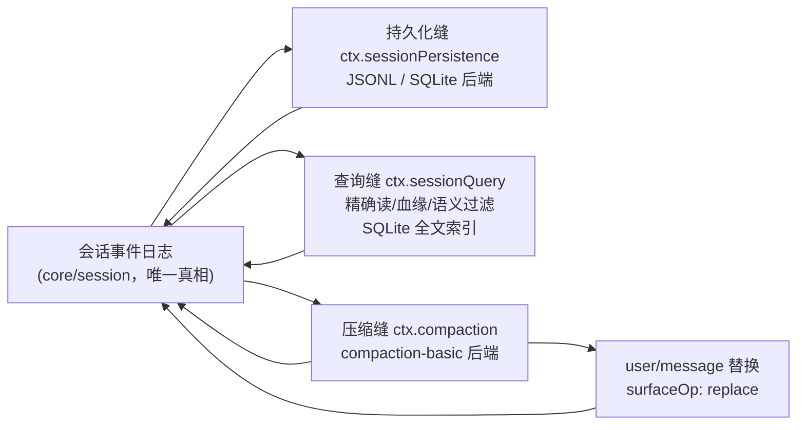

# 【第 06 篇】记忆的落地：持久化 / session-query / compaction

> 难度：🟡 进阶（建议先读第 02 篇）
> 前置阅读：`第02篇-core产品主干.md`
> 对应目录：`deepseek-harness/packages/session/`、`deepseek-harness/packages/session-query/`、`deepseek-harness/packages/compaction/`

## 目录

- [0 功能需求（WHY）](#0-功能需求why)
- [1 架构设计（WHAT）](#1-架构设计what)
- [2 实现落点（HOW）](#2-实现落点how)
- [3 产物演示（EXAMPLE）](#3-产物演示example)
- [4 动手验证](#4-动手验证🧪)
- [5 FAQ 与自测](#5-faq-与自测❓)
- [6 延伸阅读](#6-延伸阅读📚)

---

## 0 功能需求（WHY）

### 0.1 背景与场景

第 02 篇的会话日志是**内存中**的真相源。但"记忆"要真正可用，还差三件事：**落盘**（进程重启后还在）、**检索**（从历史里找到东西）、**压缩**（上下文窗口装不下时）。三个场景：

1. **崩溃恢复**：长任务跑到一半进程崩了——重启后必须能恢复会话，且日志保持平衡（不能有"开了轮不关轮"）；
2. **跨会话检索**：用户问"我上次让 agent 查的那份文件路径是什么"——需要全文检索历史会话；
3. **上下文窗口**：长对话逼近模型窗口上限——需要把旧内容**压缩成摘要**，替换出窗口，且这个过程可审计、可回放。

### 0.2 需求陈述

**R1 · 持久可恢复**——事件日志经持久化缝落盘（JSONL/SQLite 可互换后端），崩溃后恢复并保持事件平衡。

- 实例：崩溃恢复时发现孤儿 `turn/start`，后端合成 `turn/end { reason: { kind: 'interrupted' } }` 关轮（[persistence.md 第 15 行](../../deepseek-harness/docs/subsystems/persistence.md)）。
- 为什么必须：长任务的中断不能丢；日志不平衡会破坏派生（第 02 篇 R1 的地基）。

**R2 · 持久化不引入平行事件类型**——持久化只搬运既有 `SessionEvent`，**没有平行的持久化事件类型**。

- 实例：官方原文 *"no parallel persisted event type"*（[persistence.md 第 7 行](../../deepseek-harness/docs/subsystems/persistence.md)）。
- 为什么必须：两套事件 = 两套真相；持久化是"搬运工"不是"翻译官"。

**R3 · 检索有界**——跨会话语料查询有界可读：精确读、语义过滤、血缘追踪、SQLite 全文索引（提供者负责索引生命周期）。

- 实例：`SessionEventSurface` 区分事件是当前模型上下文、被压缩替换（shadowed）还是仅日志（log-only）。
- 为什么必须：历史是金矿也是泥潭；无界检索 = 性能炸弹。

**R4 · 上下文可压缩**——compaction 缝（可选能力，非主干）把旧范围**摘要化**，以 `user/message` + `surfaceOp: replace` 替换出模型可见面，全程日志可回放。

- 实例：`compaction/start` → 摘要 → `compaction/summary` → 替换 → `compaction/end`，锁最后释放（[compaction.md 第 19 行](../../deepseek-harness/docs/subsystems/compaction.md)）。
- 为什么必须：模型窗口有限，长任务必须能"忘记"；但"忘记"必须是显式、可审计的。

### 0.3 非功能需求

| 编号 | 约束 | 衡量方式 |
|---|---|---|
| N1 | **不阻塞**：`session/event` 是同步通知，持久化复制不阻塞生产者；flush 是显式检查点 | 循环感知的持久化延迟有界 |
| N2 | **批处理有界**：固定批处理窗口，只限制有意的等待，不限制调度或后端延迟 | 有配置上限（bounded batching） |
| N3 | **可回放**：compaction 的 summary 事件携带 provider/model/usage/rawOutput，一次请求可从日志+代码重建 | `llmStreamCall: true` 标记完整调用路径 |
| N4 | **只读检索**：session-query 全部只读，不改写日志 | 查询永不产生副作用 |
| N5 | **版本受控**：日志格式钉在 `SESSION_FORMAT_VERSION = 0`（pre-release，无兼容承诺） | 格式变更显式 bump |

### 0.4 验收标准

| 需求 | 验收示例（做到 = 通过） | 失败示例（做不到 = 没通过） |
|---|---|---|
| R1 | 崩溃后恢复：孤儿 turn 被合成 interrupted 关闭，前后事件未变 | 日志出现不平衡的 open turn |
| R2 | JSONL 与 SQLite 后端切换，事件类型零改动 | 后端各自发明事件类型 |
| R3 | 跨会话全文检索命中历史内容；shadowed 事件被正确分类 | 检索返回被压缩掉的旧内容当作当前上下文 |
| R4 | 长对话压缩后：窗口内是摘要替换，窗口外完整可查（shadowed） | 压缩丢数据或不可审计 |

### 0.5 边界与不做什么

- **compaction 不是主干**：它是可选能力缝，不在 agent-loop spine 内（[compaction.md 第 5 行](../../deepseek-harness/docs/subsystems/compaction.md)）。
- **query 只读**：检索不产生任何日志副作用（N4）。
- **不做 UI**：会话浏览、历史 UI 属于 `client/` 的 `ui-trajectory` 等。
- **不做标题/遥测**：那是 `session-title`、`session-telemetry` 包的职责。

### 0.6 设计哲学（原则 → 引出的需求）

| 原则 | 内容 | 引出的需求 |
|---|---|---|
| P1 搬运不翻译 | 持久化只搬运既有事件，无平行类型 | R2 |
| P2 合成平衡 | 崩溃造成的孤儿边界由合成事件平衡，不改动前后独立事件 | R1 |
| P3 锁最后释放 | compaction/end 最后落账，崩溃 = 可检测的孤儿锁 | R4 / N3 |
| P4 摘要替换不删除 | 压缩是 surface 替换，原事件转 shadowed 仍可查 | R4 / R3 |
| P5 查询只读 | 检索永不写日志 | N4 |

### 0.7 备选技术路径

| 路径 | 思路 | 优势 | 代价 | 需求匹配 |
|---|---|---|---|---|
| A. 整库快照 | 定期序列化整个会话状态 | 恢复简单 | 中间态丢失、写放大、无法逐事件审计 | R1 部分、N3 落空 |
| B. 平行持久化类型 | 持久化层自建事件结构 | 层内自由 | 两套真相必然漂移 | R2 落空 |
| C. 事件日志后端（**本项目**） | 同词汇 + 可互换后端（JSONL/SQLite） | 零漂移、可审计 | 后端能力差异要治理（如 SQLite 的 locate 返回 undefined） | 满足 R1/R2 |
| D. 内存全量查询 | 检索直接在内存日志上做 | 无索引设施 | 跨会话检索无法规模化 | R3 落空 |
| E. 全量重放代替压缩 | 永远把全部历史塞给模型 | 无压缩逻辑 | 窗口有限，长任务必炸 | R4 落空 |
| F. 压缩缝（**本项目**） | 可插拔后端 + 日志化生命周期 | 可换后端、可审计 | 锁与替换语义要严格治理 | 满足 R4 |

**选型结论**：三件事（落盘/检索/压缩）各自成缝、共享"日志是唯一真相"的地基——持久化搬运它、查询读它、压缩改写它的 surface 投影，但**从不另起炉灶**（P1 贯穿三缝）。

## 1 架构设计（WHAT）

### 1.1 总体架构：三个缝围着同一根日志



**四步读懂**：

1. **持久化缝**是日志的"搬运工"：同步通知 + 批处理窗口 + 显式 flush 检查点，两个后端（JSONL 逐会话文件、SQLite 单库）实现同一契约（R1/R2）；
2. **查询缝**是日志的"阅读器"：全部只读，跨会话语料、精确读、血缘追踪、语义过滤（R3）；
3. **压缩缝**是日志的"整理员"：锁 → 摘要 → 替换 → 解锁，把旧范围从模型可见面替换成摘要（R4）；
4. **替换本身也是事件**：压缩的产物是 `user/message`（surfaceOp: replace），**不是**新的特殊事件——模型可见面永远只由 surface 事件构成（P4）。

### 1.2 关键架构决策（需求 → 方案 → 权衡）

| # | 决策 | 对应需求 | 权衡 |
|---|---|---|---|
| D1 | **flush 检查点**：`session/flush` 取消批处理等待、排干到 quiescence，作为循环的顺序与错误观察点 | N1/N2 | 有界批处理窗口；换来循环感知持久化 |
| D2 | **崩溃合成 interrupted**：孤儿 turn 由后端合成关闭，不截断 | R1 | 合成事件是后端产物；换来不丢大 turn 的任何事件 |
| D3 | **compaction 三事件 + 锁后置**：start/summary/end，end 最后落账 | R4 / N3 | 锁语义复杂（手动/自动、孤儿检测）；换来崩溃可检测 |
| D4 | **summary 走 user/message replace**：不扩展 SurfaceEventType | R4 | 表面突变只有压缩一种；换来模型可见面语义不变 |
| D5 | **SQLite 全文索引归提供者**：索引生命周期由 session-query-sqlite 负责 | R3 | 提供者职责变重；换来定义包与索引实现解耦 |

### 1.3 关系网

- **下游**：persistence 缝消费 core/session 的 `SessionEvent` 词汇；compaction 缝依赖 `dsh-session` 与 `dsh-llm`（摘要调用走 `ctx.llm.stream()`，[compaction.md 第 5 行](../../deepseek-harness/docs/subsystems/compaction.md)）；
- **上游**：`session-query-sqlite` 提供全文索引；`session-telemetry`、`session-title` 是日志的另两个派生消费者；
- **守护**：`scripts/gen-persistence-catalog.ts` 生成持久化事件目录，`verify-persistence-catalog` 保鲜（[persistence-catalog.md](../../deepseek-harness/docs/persistence-catalog.md)）。

## 2 实现落点（HOW）

### 2.1 文件导航表（按阅读顺序）

| 顺序 | 文件（点击直达） | 关注点 | 对应需求 |
|---|---|---|---|
| 1 | [packages/session/session-persistence/src](../../deepseek-harness/packages/session/session-persistence/src) | `SessionPersistence` 抽象服务（locate/create/append/load/inspect） | R1/R2 |
| 2 | [packages/session/session-persistence-jsonl/src](../../deepseek-harness/packages/session/session-persistence-jsonl/src) | JSONL 后端（project/session 目录布局） | R1 |
| 3 | [packages/session-query/session-query/src/types.ts](../../deepseek-harness/packages/session-query/session-query/src/types.ts) | `SessionEventSurface`（第 14~16 行）、`SessionRecord` | R3 |
| 4 | [packages/session-query/session-query-sqlite/src](../../deepseek-harness/packages/session-query/session-query-sqlite/src) | SQLite 全文索引生命周期 | R3 |
| 5 | [packages/compaction/compaction/src/types.ts](../../deepseek-harness/packages/compaction/compaction/src/types.ts) | `CompactionResult` 与三事件 payload | R4 |
| 6 | [packages/compaction/compaction-basic/src](../../deepseek-harness/packages/compaction/compaction-basic/src) | 基础压缩后端（thresholdRatio/retainRatio 配置见 [headless-agent cordis.yml 第 76~82 行](../../deepseek-harness/examples/headless-agent/cordis.yml)） | R4 |

### 2.2 关键实现片段

**片段 A：位置提示，不是授权**（[persistence.md 第 25~37 行](../../deepseek-harness/docs/subsystems/persistence.md)）

```ts
interface SessionLocation {
  readonly kind: string
  readonly path: string
}
```

翻译：`locate(meta)` 同步返回后端拥有的独立产物位置（JSONL 返回绝对 transcript 路径；SQLite 返回 undefined——会话共享一个库）。官方注释强调：*"Consumers must treat it as a location hint, never as an authorization token"*（第 29~30 行）——路径可能尚未物化、可能不含未 flush 的轮次。

**片段 B：压缩结果的三段 seq**（[compaction/src/types.ts 第 29~43 行](../../deepseek-harness/packages/compaction/compaction/src/types.ts)）

```ts
interface CompactionResult {
  compactionId: CompactionId
  startSeq: number
  summarySeq: number
  endSeq: number
  summary: ContentBlock[]
}
```

翻译：一次成功的压缩返回它的完整**日志生命周期**——`startSeq`/`summarySeq`/`endSeq` 三个事件的位置（R4 可审计），加上摘要内容块。任何消费方都能据此在日志里定位整次压缩。

**片段 C：事件的三种表面状态**（[session-query/src/types.ts 第 14~16 行](../../deepseek-harness/packages/session-query/session-query/src/types.ts)）

```ts
type SessionEventSurface = 'current' | 'shadowed' | 'log-only'
```

翻译：检索时每个事件被分类为三种状态：`current`（当前模型上下文）、`shadowed`（被压缩替换的旧范围，仍在日志里可查）、`log-only`（从不进模型可见面，如 compaction 自身的事件）。这个三态是"摘要替换不删除"（P4）在类型层面的落点。

### 2.3 符号 hover 指引

在 VS Code 打开 [packages/session-query/session-query/src/types.ts](../../deepseek-harness/packages/session-query/session-query/src/types.ts) hover `SessionEventSurface`；打开 [packages/compaction/compaction/src/types.ts](../../deepseek-harness/packages/compaction/compaction/src/types.ts) hover `CompactionResult` 查看官方 JSDoc。

## 3 产物演示（EXAMPLE）

### 3.1 输入

真实快照 `examples/headless-agent/tests/snapshots/compaction-recovery/session.jsonl`（[完整文件见此处](../../deepseek-harness/examples/headless-agent/tests/snapshots/compaction-recovery/session.jsonl)，32 行）——一次带压缩的会话，其中压缩由模型请求触发。

### 3.2 产物（真实 compaction 生命周期事件）

> 以下为仓库现存快照的**逐字符拷贝**（seq 19~22 节选）；行号与注释列为本文档添加。

<table style="border-collapse:collapse;width:100%;font-size:13px">
  <tr style="background:#f6f8fa">
    <th style="border:1px solid #d0d7de;padding:5px 8px;width:36px">行</th>
    <th style="border:1px solid #d0d7de;padding:5px 8px">真实产物（JSONL）</th>
    <th style="border:1px solid #d0d7de;padding:5px 8px">行内注释</th>
  </tr>
  <tr style="background:#fff8c5">
    <td style="border:1px solid #d0d7de;padding:5px 8px;text-align:center;color:#57606a">1</td>
    <td style="border:1px solid #d0d7de;padding:5px 8px;font-family:monospace">{"type":"compaction/start","seq":19,…"data":{"compactionId":"338e88fa-…","turn":1}}</td>
    <td style="border:1px solid #d0d7de;padding:5px 8px"><b>🎯 压缩开始</b>：取得日志记录的锁（turn=1 自动轮次）</td>
  </tr>
  <tr style="background:#fff8c5">
    <td style="border:1px solid #d0d7de;padding:5px 8px;text-align:center;color:#57606a">2</td>
    <td style="border:1px solid #d0d7de;padding:5px 8px;font-family:monospace">{"type":"compaction/summary","seq":20,…"summary":[{"type":"text","text":"The request established a durable compaction premise."}],"rawOutput":[…],"llmStreamCall":true,"shadowedRange":{"start":4,"end":4},"shadowedSeqs":[4],"shadowedTokenCount":266,"provider":"deepseek-official","model":"deepseek-v4-flash","maxTokens":32,"usage":{"inputTokens":20,"outputTokens":4}}</td>
    <td style="border:1px solid #d0d7de;padding:5px 8px"><b>🎯 摘要记录</b>：摘要文本、<code>llmStreamCall:true</code>（完整调用路径）、shadowed 范围（seq 4，266 token）、usage 全部入账（N3）</td>
  </tr>
  <tr style="background:#fff8c5">
    <td style="border:1px solid #d0d7de;padding:5px 8px;text-align:center;color:#57606a">3</td>
    <td style="border:1px solid #d0d7de;padding:5px 8px;font-family:monospace">{"type":"compaction/end","seq":22,…"data":{"compactionId":"338e88fa-…","turn":1}}</td>
    <td style="border:1px solid #d0d7de;padding:5px 8px"><b>🎯 压缩结束</b>：锁最后释放（P3）</td>
  </tr>
</table>

### 3.3 发生了什么（压缩生命周期的五步）

1. 压缩开始：`compaction/start` 落账并取得锁（行 1）；
2. 后端调用 `ctx.llm.stream()` 生成摘要（一次请求，`llmStreamCall: true` 标记完整调用路径）；
3. `compaction/summary` 记录：摘要、被遮蔽范围（seq 4 的旧事件，266 token）、模型与 usage（行 2）；
4. 摘要以 `user/message` + `surfaceOp: replace` 替换进模型可见面（此快照 seq 21）；
5. `compaction/end` 释放锁（行 3）——崩溃发生在 2~4 之间 = 可检测的孤儿锁。

### 3.4 观察点（对应产物表中的行号）

- **行 1~3 共享同一 `compactionId`**：一次压缩的完整生命周期可被唯一追踪（R4 可审计）；
- **行 2 的 `shadowedSeqs:[4]`**：被替换的旧事件**仍在日志里**（P4 摘要替换不删除，检索时分类为 shadowed）；
- **行 2 的 `llmStreamCall:true` 与 usage**：压缩的模型调用可完整重建（N3 可回放）；
- **行 1 与行 3 的 `turn:1`**：自动压缩归属某个 turn，手动压缩则此字段为 null（[compaction.md 第 15 行](../../deepseek-harness/docs/subsystems/compaction.md)）。

## 4 动手验证（🧪）

> 以下命令已在本机实测（仓库根目录 `deepseek-harness\deepseek-harness` 下执行）。

### 任务 1：亲手找到压缩的生命周期

```powershell
Select-String -Path "examples\headless-agent\tests\snapshots\compaction-recovery\session.jsonl" -Pattern '"type":"compaction/'
```

**预期**：命中三行（start/summary/end）。**判据**：三行共享同一 `compactionId`（对照第 3.2 节）。

### 任务 2：读持久化缝的契约

打开 [packages/session/session-persistence/src](../../deepseek-harness/packages/session/session-persistence/src) 的 index，找到 `SessionPersistence` 服务声明的方法（locate/create/append/load/inspect 等），再对照 [persistence.md 第 7 行](../../deepseek-harness/docs/subsystems/persistence.md) 的官方描述。

### 任务 3（进阶）：看生成的持久化目录

打开 [docs/persistence-catalog.md](../../deepseek-harness/docs/persistence-catalog.md)，确认它由 `scripts/gen-persistence-catalog.ts` 生成、由 `verify-persistence-catalog` 保鲜——然后找一个你认识的 surface 事件（如 `user/message`），看它的完整 payload 声明。

## 5 FAQ 与自测（❓）

### FAQ

- **Q1：JSONL 和 SQLite 后端怎么选？** 部署形态决定：JSONL 是逐会话文件（便于人工查看、git 追踪），SQLite 是单库（便于规模化查询）。两个后端实现同一契约（R2），切换零改动。
- **Q2：compaction 是主干功能吗？** 不是。它是可选能力缝（不在 agent-loop spine 内）。`compaction-basic` 是默认后端，可以换成 tokenizer/模板后端（[compaction.md 第 5 行](../../deepseek-harness/docs/subsystems/compaction.md)）。
- **Q3：shadowed 和 log-only 什么区别？** shadowed = 曾被模型看到、后被压缩替换的旧事件（当前不可见但可查）；log-only = 从不进模型可见面的事件（如 compaction 自身的三事件）。
- **Q4：崩溃恢复时 `interrupted` 是谁发的？** 后端加载日志时发现孤儿 `turn/start`，合成 `turn/end { reason: { kind: 'interrupted' } }`——这是唯一一个循环自己不会发出的 TurnEndReason（[persistence.md 第 15 行](../../deepseek-harness/docs/subsystems/persistence.md)）。
- **Q5：压缩会删数据吗？** 不删。压缩只是把旧范围从**模型可见面**替换成摘要；原事件留在日志里，检索时标记为 shadowed（P4）。

### 自测（答案折叠在下方）

1. "持久化不引入平行事件类型"对应哪条需求？为什么重要？
2. 崩溃恢复时孤儿 turn 怎么处理？
3. `SessionEventSurface` 的三种取值是什么？
4. 压缩的锁什么时候释放？崩溃后怎么检测？
5. 下列哪个不属于本组职责？A. 会话落盘 B. 跨会话检索 C. 摘要生成 D. 模型适配

<details>
<summary>点开看答案</summary>

1. R2。两套事件 = 两套真相，必然漂移；持久化只是搬运工。
2. 合成 `turn/end { reason: { kind: 'interrupted' } }` 关闭，不截断、不改动前后独立事件。
3. `current`（当前上下文）/ `shadowed`（被压缩替换，可查）/ `log-only`（从不进模型可见面）。
4. `compaction/end` 最后落账；崩溃在 start 与 end 之间 = 可检测的孤儿锁（有 start 无 end）。
5. D。模型适配属于 `packages/llm/`。

</details>

## 6 延伸阅读（📚）

**官方（权威来源）**：

- [docs/subsystems/persistence.md](../../deepseek-harness/docs/subsystems/persistence.md) —— 持久化缝全契约（flush/恢复/prepare，385 行）
- [docs/subsystems/session-query.md](../../deepseek-harness/docs/subsystems/session-query.md) —— 查询词汇与提供者（495 行）
- [docs/subsystems/compaction.md](../../deepseek-harness/docs/subsystems/compaction.md) —— 压缩缝与三事件语义（238 行）
- [docs/persistence-catalog.md](../../deepseek-harness/docs/persistence-catalog.md) —— 生成的完整持久化事件目录

**决策记录（WHY 的一手来源）**：

- 🔴 [.agents/notes/implemented/architecture/2026-06-14-session-persistence.md](../../deepseek-harness/.agents/notes/implemented/architecture/2026-06-14-session-persistence.md) —— 持久化缝设计
- 🔴 [.agents/notes/implemented/feature/2026-06-18-compaction-capability-seam.md](../../deepseek-harness/.agents/notes/implemented/feature/2026-06-18-compaction-capability-seam.md) —— 压缩缝设计（含"为什么复用 user/message"）

**外部文献（按难度递增）**：

- 🟢 [Event Sourcing（Martin Fowler）](https://martinfowler.com/eaaDev/EventSourcing.html) —— 事件日志持久化的理论源头
- 🟡 [SQLite FTS5 全文搜索](https://www.sqlite.org/fts5.html) —— session-query-sqlite 的索引机制
- 🔴 [上下文压缩研究（LLMLingua 等）](https://arxiv.org/abs/2310.05736) —— 压缩策略的学术背景

---

**下一篇预告**：【第 07 篇】多智能体：subagent / workflow / jobs——把任务分出去。
