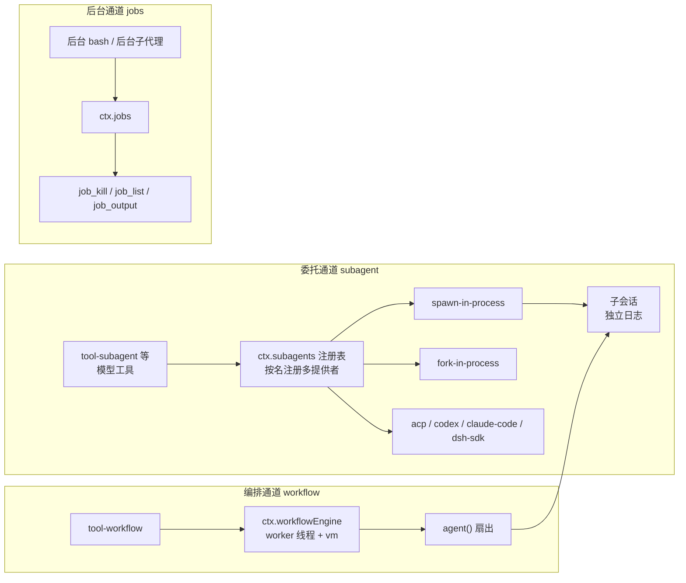

# 【第 07 篇】多智能体：subagent / workflow / jobs——把任务分出去

> 难度：🟡 进阶（建议先读第 02、03 篇）
> 前置阅读：`第03篇-shell能力缝.md`（能力缝概念）
> 对应目录：`deepseek-harness/packages/subagent/`、`deepseek-harness/packages/workflow/`、`deepseek-harness/packages/jobs/`

## 目录

- [0 功能需求（WHY）](#0-功能需求why)
- [1 架构设计（WHAT）](#1-架构设计what)
- [2 实现落点（HOW）](#2-实现落点how)
- [3 产物演示（EXAMPLE）](#3-产物演示example)
- [4 动手验证](#4-动手验证🧪)
- [5 FAQ 与自测](#5-faq-与自测❓)
- [6 延伸阅读](#6-延伸阅读📚)

---

## 0 功能需求（WHY）

### 0.1 背景与场景

第 02 篇的循环驱动**一个** Agent。但真实任务常常需要"把活分出去"：

1. **并行调研**：一个 agent 太慢——开几个子代理各查一块，主代理汇总；
2. **后台运行**：跑一个长任务的同时继续对话——任务在后台跑，完成后通知；
3. **编排脚本**：主代理写一段 JS 脚本，脚本启动一批子代理、收集结果、合并返回——"agent 编排 agent"。

三个能力组各回答一个问题：**subagent**（把任务委托给子代理）、**workflow**（让模型写脚本来批量编排子代理）、**jobs**（通用的后台任务运行时，前两者的后台机制共用）。

### 0.2 需求陈述

**R1 · 委托可插拔（subagent 缝）**——子代理可以是进程内新会话、fork 延续、也可以是**其他产品**（ACP/Claude Code/Codex），同一接口按名注册、多提供者共存。

- 实例：官方原文 *"multiple provider implementations coexist in one context, registered by name (ctx.subagents), while bash allows only one executor"*（[subagent.md 第 5 行](../deepseek-harness/docs/subsystems/subagent.md)）。
- 为什么必须：委托对象的选择是部署形态问题（本机进程 vs 外部工具），接口必须统一而实现可以并存。

**R2 · 能力显式声明**——提供者的能力（输出 schema、深度限制、工具过滤、人设）在静态描述符上声明，请求超出能力**大声拒绝**（`UNSUPPORTED_CAPABILITY`），绝不"接受然后忽略"。

- 实例：`SubagentCapabilities` 四个标志与请求选项一一对应（[subagent.md 第 27~32 行](../deepseek-harness/docs/subsystems/subagent.md)）。
- 为什么必须：静默降级是安全与质量事故的温床（"fail loud, no silent degradation"）。

**R3 · 可继续的会话（continuable）**——子代理可以被 `send_message` 继续对话、`interrupt_agent` 打断、`list_agents` 枚举；"可继续"是提供者一个可选方法**存在与否**即能力。

- 实例：`SubagentProvider.prepareContinuable` 方法存在 = 该提供者支持可继续子代理，TypeScript 收窄即发现机制。
- 为什么必须：一次性的"跑完就完"不够——父代理需要中途追问、修正。

**R4 · 模型可写编排（workflow 缝）**——工作流是**模型写的 JavaScript 脚本**（worker 线程内运行），脚本通过 `agent()` 扇出子代理；`meta`/`args` 是纯 JSON 数据，引擎先校验后运行。

- 实例：官方原文 *"a model-written orchestration SCRIPT that starts subagents"*（[workflow.md 第 5 行](../deepseek-harness/docs/subsystems/workflow.md)）。
- 为什么必须：固定编排模式不够灵活；让模型写脚本 = 编排能力随模型能力增长。

**R5 · 后台任务统一管控（jobs）**——长任务（后台 bash、后台子代理）注册进 `ctx.jobs`，用统一三工具（`job_kill`/`job_list`/`job_output`）管控。

- 实例：`JobKindMap` 目前声明 `bash` 与 `subagent` 两种 kind（[jobs.md 第 17~23 行](../deepseek-harness/docs/subsystems/jobs.md)）。
- 为什么必须：每种后台机制各搞一套控制 API = 模型要学 N 套；统一 = 学一套。

### 0.3 非功能需求

| 编号 | 约束 | 衡量方式 |
|---|---|---|
| N1 | **血缘贯通**：子代理与工作流孩子的 parent 必填，cwd/lineage/depth 从父会话传递 | 任意子会话可追溯父链 |
| N2 | **有界扇出**：workflow 引擎有 `maxTotalAgents` 总子代理上限，脚本不可观察/不可改写该策略 | 脚本无法绕过上限 |
| N3 | **后台结算通知**：后台任务完成以 `user/message` 注入（agent.inject）通知父代理 | 父代理不轮询 |
| N4 | **会话分离**：父子会话分别落盘（parent/child 独立日志），结算消息跨会话传递 | 各自可独立重放 |
| N5 | **能力不符即拒**：请求需要的标志提供者没有 → 启动前 typed error | 绝不接受后忽略 |

### 0.4 验收标准

| 需求 | 验收示例（做到 = 通过） | 失败示例（做不到 = 没通过） |
|---|---|---|
| R1 | 同一 `subagent` 工具，配置指向 in-process 或 codex 提供者，模型零感知 | 换委托后端要改工具 |
| R2 | 请求 toolFilter 但提供者不支持 → 启动前 UNSUPPORTED_CAPABILITY | 请求被默默忽略 |
| R3 | 后台子代理可被 send_message 继续对话 | 子代理跑完就死，无法追问 |
| R4 | 模型写的脚本经 worker 线程运行，扇出受 maxTotalAgents 约束 | 脚本绕过上限或直接跑在宿主进程 |
| R5 | 后台 bash 与后台子代理用同一套 job_* 工具管控 | 每类后台各自一套 API |

### 0.5 边界与不做什么

- **不是主干**：subagent 与 workflow 都是**可选能力**，不在 agent-loop spine 内（官方明确）。
- **不做进程隔离**：workflow 脚本跑在 worker 线程（不是沙箱进程）；子代理的隔离由各提供者（如 sandbox）决定。
- **不做定时任务**：定时跟进属于 `schedule` 组。
- **不做目标管理**：同会话目标（goal）是另一套机制（后续篇目）。

### 0.6 设计哲学（原则 → 引出的需求）

| 原则 | 内容 | 引出的需求 |
|---|---|---|
| P1 多提供者共存 | subagent 缝按名注册多提供者（区别于 bash 单执行器） | R1 |
| P2 fail loud | 能力不满足即拒绝，绝不接受后忽略 | R2 / N5 |
| P3 方法存在即能力 | continuable 以可选方法收窄为发现机制 | R3 |
| P4 数据与代码分离 | workflow 的 meta/args 是纯 JSON 数据，引擎先校验后求值 | R4 / N2 |
| P5 统一后台 | 所有长任务共用 ctx.jobs 与 job_* 工具 | R5 |

### 0.7 备选技术路径

| 路径 | 思路 | 优势 | 代价 | 需求匹配 |
|---|---|---|---|---|
| A. 单子代理硬编码 | 只支持一种进程内子代理 | 实现最少 | 无法接外部产品（Codex/Claude）；无法并存 | R1 落空 |
| B. 能力不声明 | 所有提供者假设支持全部选项 | 接口简单 | 静默降级事故 | R2 落空 |
| C. 提供者注册表（**本项目**） | 按名注册 + 能力标志 + 可选 continuable | 生态可扩展、契约可验证 | 注册表语义要治理 | 满足 R1~R3 |
| D. 固定编排 DSL | 预设几种编排模式（并行/串联） | 引擎简单 | 表达力有限，随任务增长必然加模式 | R4 落空 |
| E. 模型写脚本（**本项目**） | worker 线程 + vm 上下文 + 上限约束 | 编排能力随模型增长 | 脚本执行有风险面（有界扇出+数据隔离对冲） | 满足 R4 |
| F. 每类后台各自 API | bash 后台一套、子代理后台一套 | 各自简单 | 模型学习成本高 | R5 落空 |

**选型结论**：委托（C）+ 编排（E）+ 后台（统一 jobs）三者组合，让"把活分出去"成为**可插拔、可审计、可继续**的一等公民；其中 P2（fail loud）与 N2（有界扇出）是安全底线。

## 1 架构设计（WHAT）

### 1.1 总体架构：三条"分身"通道



**四步读懂**：

1. **委托通道**：模型经 `tool-subagent` 调用 `ctx.subagents`；注册表按**名字**选择提供者（区别于 bash 的"一个上下文一个执行器"）——进程内、fork、外部产品并存（R1）；
2. **编排通道**：模型写脚本 → worker 线程引擎 → 脚本内 `agent()` 调用经 `ctx.subagents` 扇出（R4）；`parent` 必填，所有孩子归属调用 Agent（N1）；
3. **后台通道**：后台 bash 与后台子代理都注册进 `ctx.jobs`，统一三工具管控（R5）；
4. **结算通知**：后台任务完成 → 以 `user/message` 注入父代理 inbox（N3），父代理"醒来"继续。

### 1.2 关键架构决策（需求 → 方案 → 权衡）

| # | 决策 | 对应需求 | 权衡 |
|---|---|---|---|
| D1 | **按名注册的多提供者注册表**（跟随 LLM 适配器注册表模式，非 bash 单执行器） | R1 | 注册表语义更复杂；换来委托对象可并存 |
| D2 | **静态能力描述符 + 启动前校验**：`SubagentCapabilities` 标志与请求选项一一对应 | R2 / N5 | 提供者要如实声明；换来零静默降级 |
| D3 | **continuable 方法存在即能力**：`prepareContinuable` 可选方法 + TS 收窄 | R3 | 能力发现依赖类型系统；换来"可继续"无需额外元数据 |
| D4 | **worker 线程 + vm 上下文**：脚本不跑在宿主主线程；meta/args 纯 JSON 先校验 | R4 / N2 | 脚本能力受限（无文件系统/网络 API）；换来风险有界 |
| D5 | **job 结算经 agent.inject**：后台完成通知走 user/message 注入 | N3 | 通知时序要管理；换来父代理零轮询 |

### 1.3 关系网

- **上游**：subagent 提供者消费 `ctx.sessions`（子会话）、`ctx.sessionPersistence`（子会话落盘）；codex/claude-code 提供者经 `ctx.subprocess` 启动外部进程；acp 提供者经 ACP 协议连接；
- **下游**：`tool-workflow` 与 `tool-subagent` 都注册进 `ctx.tools`（第 02 篇守卫管线）；`tool-subagent-control` 提供全局三控制工具；
- **平级**：`tool-ralph` 是 workflow 的固定消费者（fresh-agent 迭代），与 `goal` 机制配合（后续篇目）。

## 2 实现落点（HOW）

### 2.1 文件导航表（按阅读顺序）

| 顺序 | 文件（点击直达） | 关注点 | 对应需求 |
|---|---|---|---|
| 1 | [packages/subagent/subagent/src/types.ts](../deepseek-harness/packages/subagent/subagent/src/types.ts) | `SubagentCapabilities`、`SubagentStartRequest` | R1/R2 |
| 2 | [packages/subagent/subagent/src/continuation.ts](../deepseek-harness/packages/subagent/subagent/src/continuation.ts) | 可继续子代理编排 | R3 |
| 3 | [packages/workflow/workflow/src/types.ts](../deepseek-harness/packages/workflow/workflow/src/types.ts) | `WorkflowStartRequest`（script/meta/args/parent） | R4 |
| 4 | [packages/workflow/workflow-worker-thread/src](../deepseek-harness/packages/workflow/workflow-worker-thread/src) | worker 线程引擎实现 | R4 / N2 |
| 5 | [packages/jobs/jobs/src/types.ts](../deepseek-harness/packages/jobs/jobs/src/types.ts) | `JobKindMap`、`JobStatus` | R5 |
| 6 | [packages/subagent/tool-subagent/src](../deepseek-harness/packages/subagent/tool-subagent/src) | 委托工具（per-provider 注册） | R1 |
| 7 | [packages/subagent/tool-subagent-control/src](../deepseek-harness/packages/subagent/tool-subagent-control/src) | send_message / interrupt_agent / list_agents | R3 |

### 2.2 关键实现片段

**片段 A：能力声明与请求一一对应**（[subagent/src/types.ts](../deepseek-harness/packages/subagent/subagent/src/types.ts)）

```ts
interface SubagentCapabilities {
  readonly outputSchema: boolean
  readonly depthLimit: boolean
  readonly toolFilter: boolean
  readonly persona: boolean
}
```

翻译：提供者**静态声明**自己支持什么（输出 schema、深度上限、工具过滤、人设）。官方注释强调：*"a request that needs a capability the chosen provider lacks is rejected with a typed error rather than accepted-then-ignored (the 'fail loud, no silent degradation' rule)"*（第 18~20 行）——标志与请求选项一一对应，服务在 `start` 前校验（R2）。

**片段 B：模型写的工作流请求**（[workflow/src/types.ts](../deepseek-harness/packages/workflow/workflow/src/types.ts)）

```ts
interface WorkflowStartRequest {
  script: string
  meta: WorkflowMeta
  args?: unknown
  subagentProvider?: string
}
```

翻译：工作流的输入是**一段 JavaScript 脚本**（模型写的），`meta` 是身份块、`args` 是输入数据。官方注释明确：*"meta and args are plain JSON DATA (the engine validates meta against its schema and rejects loud BEFORE anything runs — no script text is ever evaluated to obtain it)"*（[workflow.md 第 11~12 行](../deepseek-harness/docs/subsystems/workflow.md)）——数据先校验、脚本后求值（P4）。

**片段 C：统一后台任务的身份**（[jobs/src/types.ts](../deepseek-harness/packages/jobs/jobs/src/types.ts)）

```ts
interface JobKindMap {
  bash: 'bash'
  subagent: 'subagent'
}
```

翻译：`JobKind` 由合并可扩展映射派生（第 01 篇 P5 的又一个实例），注册表把每种 kind 当作不透明 id 命名空间。`JobStatus` 五种状态（running/stopping/completed/killed/failed），提供者特有事实放 `JobSnapshot.detail`——统一管控（R5）的类型基础。

### 2.3 符号 hover 指引

在 VS Code 打开 [packages/subagent/subagent/src/types.ts](../deepseek-harness/packages/subagent/subagent/src/types.ts) hover `SubagentCapabilities` 与 `SubagentStartRequest`；打开 [packages/workflow/workflow/src/types.ts](../deepseek-harness/packages/workflow/workflow/src/types.ts) hover `WorkflowStartRequest`。

## 3 产物演示（EXAMPLE）

### 3.1 输入

真实快照 `examples/acp-agent/tests/snapshots/subagent-continuable-inheritance/session.jsonl`（[完整文件见此处](../deepseek-harness/examples/acp-agent/tests/snapshots/subagent-continuable-inheritance/session.jsonl)，42 行）。父代理收到的用户指令：

> Follow these steps exactly, then stop. 1. Call the subagent tool once with run_in_background set to true, description 'Reply with CHILD_OK', and prompt 'Reply with exactly the word CHILD_OK and nothing else.'. 2. Reply with the single word DONE. Do not use the bash tool.

### 3.2 产物（真实委托事件对）

> 以下为仓库现存快照的**逐字符拷贝**（seq 16~17 节选）；行号与注释列为本文档添加。

<table style="border-collapse:collapse;width:100%;font-size:13px">
  <tr style="background:#f6f8fa">
    <th style="border:1px solid #d0d7de;padding:5px 8px;width:36px">行</th>
    <th style="border:1px solid #d0d7de;padding:5px 8px">真实产物（JSONL）</th>
    <th style="border:1px solid #d0d7de;padding:5px 8px">行内注释</th>
  </tr>
  <tr style="background:#fff8c5">
    <td style="border:1px solid #d0d7de;padding:5px 8px;text-align:center;color:#57606a">1</td>
    <td style="border:1px solid #d0d7de;padding:5px 8px;font-family:monospace">{"type":"tool/call","seq":16,…"callId":"call_bg_start","name":"subagent","arguments":"{\"description\": \"Reply with CHILD_OK\", \"prompt\": \"Reply with exactly the word CHILD_OK and nothing else.\", \"run_in_background\": true}"}</td>
    <td style="border:1px solid #d0d7de;padding:5px 8px"><b>🎯 后台委托</b>：模型调用 subagent 工具，run_in_background=true（R5 的入口）</td>
  </tr>
  <tr style="background:#fff8c5">
    <td style="border:1px solid #d0d7de;padding:5px 8px;text-align:center;color:#57606a">2</td>
    <td style="border:1px solid #d0d7de;padding:5px 8px;font-family:monospace">{"type":"tool/result","seq":17,…"text":"started subagent 33333333-3333-4333-8333-333333333333","isError":false}</td>
    <td style="border:1px solid #d0d7de;padding:5px 8px"><b>🎯 委托确认</b>：返回子代理 id（快照固定 uuid）——后台运行立即返回，不阻塞父代理（N3 前提）</td>
  </tr>
  <tr>
    <td style="border:1px solid #d0d7de;padding:5px 8px;text-align:center;color:#57606a">3</td>
    <td style="border:1px solid #d0d7de;padding:5px 8px;font-family:monospace">{"type":"turn/start","seq":29,…"data":{"turn":2}}</td>
    <td style="border:1px solid #d0d7de;padding:5px 8px">父代理 turn 2：子代理完成后，结算通知以 user/message 注入，父代理被唤醒（N3）</td>
  </tr>
</table>

### 3.3 发生了什么（委托 → 后台 → 结算的四步）

1. 父代理收到指令（输入），在 step 1 调用 `subagent` 工具，`run_in_background: true`（行 1）；
2. 提供者启动子代理（独立子会话，parent 归属父代理），立即返回 `started subagent <id>`（行 2）——父代理不阻塞，继续输出 DONE；
3. 子代理在独立会话里完成 "Reply with CHILD_OK" 任务，其日志独立落盘（N4）；
4. 结算：子代理完成 → 通知以 `user/message` 注入父代理 inbox → 父代理 turn 2 开始（行 3），看到子代理结果并继续。

### 3.4 观察点（对应产物表中的行号）

- **行 1 的 `callId:"call_bg_start"`**：快照固定 id（真实运行是随机 call id）——快照可比对机制；
- **行 2 的 `"started subagent <uuid>"`**：委托即确认，后台语义（R5）；
- **行 3 的 `turn:2`**：父代理的第二个轮次由**结算通知**触发——"后台完成 → 注入 → 唤醒"的完整闭环（N3）；
- **行 1~3 全部在父会话日志中**：委托与结算在父侧可审计；子会话的细节在子侧（N4 血缘）。

## 4 动手验证（🧪）

> 以下命令已在本机实测（仓库根目录 `deepseek-harness\deepseek-harness` 下执行）。

### 任务 1：亲手找到"委托确认"事件

```powershell
Select-String -Path "examples\acp-agent\tests\snapshots\subagent-continuable-inheritance\session.jsonl" -Pattern 'started subagent'
```

**预期**：命中一行（tool/result 事件）。**判据**：对照第 3.2 节行 2——包含固定 uuid 33333333-3333-4333-8333-333333333333。

### 任务 2：读三种工具的分工

打开 [packages/subagent/tool-subagent-control/src](../deepseek-harness/packages/subagent/tool-subagent-control/src)，确认它注册哪三个全局工具（send_message / interrupt_agent / list_agents）；再对照 [docs/tool-catalog.md](../deepseek-harness/docs/tool-catalog.md) 中 `@deepseek-ai/dsh-tool-subagent-control` 条目。

### 任务 3（进阶）：看工作流引擎的边界

打开 [packages/workflow/workflow-worker-thread/src](../deepseek-harness/packages/workflow/workflow-worker-thread/src)，回答：引擎在什么线程运行脚本？（答案：`node:worker_threads`，每 run 一个 worker，脚本的 vm 上下文在 worker 内——[workflow.md 第 7 行](../deepseek-harness/docs/subsystems/workflow.md)）。

## 5 FAQ 与自测（❓）

### FAQ

- **Q1：subagent 缝和 bash 缝有什么本质区别？** bash 一个上下文只允许**一个**执行器；subagent 按名注册**多个**提供者并存（进程内/fork/ACP/Codex/Claude Code）——因为委托对象的选择是部署形态问题（[subagent.md 第 5 行](../deepseek-harness/docs/subsystems/subagent.md)）。
- **Q2：continuable 和 one-shot 什么区别？** one-shot 子代理跑完就结算；continuable 子代理保留会话，父代理可用 send_message 继续对话、interrupt_agent 打断。"可继续"由提供者 `prepareContinuable` 方法存在与否决定（P3）。
- **Q3：workflow 脚本安全吗？** 有界设计：脚本跑在 worker 线程的 vm 上下文（非宿主主线程）、meta/args 先校验后求值、`maxTotalAgents` 总子代理上限**脚本不可观察不可改写**（N2）。
- **Q4：后台任务完成怎么通知父代理？** 以 `user/message` 注入（agent.inject）——父代理不轮询，任务完成自动"醒来"（N3）。
- **Q5：goal 和 subagent 什么关系？** goal 是**同会话**目标持久化（create_goal/update_goal，本会话内多轮推进）；subagent 是**跨会话**委托（独立子会话）。后续篇目讲 goal。

### 自测（答案折叠在下方）

1. subagent 缝与 bash 缝在提供者数量上的区别？
2. `SubagentCapabilities` 的四个标志对应什么原则？
3. workflow 的 `meta`/`args` 为什么必须是纯 JSON 数据？
4. `JobKindMap` 目前声明哪两种 kind？
5. 后台子代理完成后的通知走什么机制？

<details>
<summary>点开看答案</summary>

1. subagent 按名注册多提供者共存；bash 一个上下文只允许一个执行器。
2. P2 fail loud——能力不符即拒绝，绝不接受后忽略（N5）。
3. 引擎先校验 meta 再求值脚本——任何脚本文本都不参与 meta 解析（P4 数据与代码分离）。
4. `bash` 与 `subagent`。
5. 结算通知以 `user/message` 注入父代理 inbox（agent.inject，N3）。

</details>

## 6 延伸阅读（📚）

**官方（权威来源）**：

- [docs/subsystems/subagent.md](../deepseek-harness/docs/subsystems/subagent.md) —— 委托缝全契约（734 行，含 provider 契约与 continuation）
- [docs/subsystems/workflow.md](../deepseek-harness/docs/subsystems/workflow.md) —— 工作流缝与引擎
- [docs/subsystems/jobs.md](../deepseek-harness/docs/subsystems/jobs.md) —— 后台任务运行时

**决策记录（WHY 的一手来源）**：

- 🔴 [.agents/notes/implemented/feature/2026-06-21-subagent-capability-seam.md](../deepseek-harness/.agents/notes/implemented/feature/2026-06-21-subagent-capability-seam.md) —— 委托缝设计
- 🔴 [.agents/notes/implemented/feature/2026-07-05-dynamic-workflows.md](../deepseek-harness/.agents/notes/implemented/feature/2026-07-05-dynamic-workflows.md) —— 动态工作流提案与理由
- 🔴 [.agents/notes/implemented/architecture/2026-06-20-generic-long-running-tool-runtime.md](../deepseek-harness/.agents/notes/implemented/architecture/2026-06-20-generic-long-running-tool-runtime.md) —— 通用长任务运行时设计

**外部文献（按难度递增）**：

- 🟢 [Anthropic: Multi-agent research system](https://www.anthropic.com/engineering/built-multi-agent-research-system) —— 多代理编排的工程实践
- 🟡 [Agent Client Protocol（ACP）](https://agentclientprotocol.com/) —— acp 提供者的协议基础
- 🔴 [node:worker_threads 文档](https://nodejs.org/api/worker_threads.html) —— workflow 引擎的宿主机制

---

**下一篇预告**：【第 08 篇】人机协作：interaction / goal / plan / guard——审批、目标与计划。
