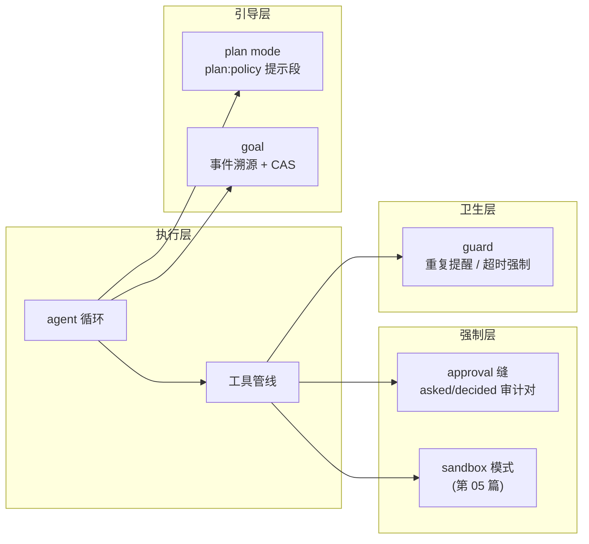

# 【第 08 篇】人机协作与治理：approval / goal / plan / guard

> 难度：🟡 进阶（建议先读第 02 篇）
> 前置阅读：`第02篇-core产品主干.md`
> 对应目录：`deepseek-harness/packages/interaction/`、`deepseek-harness/packages/goal/`、`deepseek-harness/packages/plan/`、`deepseek-harness/packages/guard/`

## 目录

- [0 功能需求（WHY）](#0-功能需求why)
- [1 架构设计（WHAT）](#1-架构设计what)
- [2 实现落点（HOW）](#2-实现落点how)
- [3 产物演示（EXAMPLE）](#3-产物演示example)
- [4 动手验证](#4-动手验证🧪)
- [5 FAQ 与自测](#5-faq-与自测❓)
- [6 延伸阅读](#6-延伸阅读📚)

---

## 0 功能需求（WHY）

### 0.1 背景与场景

Agent 不能永远自主。四个治理/协作场景：

1. **危险操作**：模型要"把文件写到工作区外"（需要把沙箱升级为 danger-full-access）——必须问人，人拒绝就拒绝；
2. **长目标**：一个目标要跨多轮推进（如"把这个项目学完"）——系统要记住目标、轮次、进度，并在多轮后仍能继续；
3. **计划先行**：复杂任务先出计划、人批准后再执行；
4. **循环卫生**：模型重复调用同一个工具、或者一次工具调用超时——系统要有提醒与强制。

### 0.2 需求陈述

**R1 · 审批可问可拒（approval 缝）**——每次审批有独立身份，结果**闭集且失败关闭**（fail-closed）：`allowed-once` / `rejected` / `cancelled` / `unavailable`；无应答即拒绝。

- 实例：官方原文 *"Callers … consume the closed outcome and fail closed unless it is `allowed-once`"*（[approval.md 第 5 行](../../deepseek-harness/docs/subsystems/approval.md)）。
- 为什么必须：审批是安全闸门；闸门故障必须默认关闭，不能默认打开。

**R2 · 审批可审计**——每次请求产生 `approval/asked` 与 `approval/decided` 审计事件对，由 `ApprovalRequestId` 配对。

- 实例：escalation-rejected 快照里 `approval/asked`（reason: escalate sandbox…）→ `approval/decided`（outcome: rejected）成对出现。
- 为什么必须：谁问了什么、怎么答的，必须可回放（呼应第 02 篇 R1）。

**R3 · 目标可持久（goal）**——同会话目标以事件溯源持久化：`GoalRef`（id + revision）CAS 更新、四种阶段（active/paused/blocked/complete）、blocked 带机器可路由的原因码。

- 实例：`GoalRef` 的 revision 每次可持久变更递增（[goal.md 第 9 行](../../deepseek-harness/docs/subsystems/goal.md)）。
- 为什么必须：目标不是聊天记录里的口头约定；跨轮次推进需要权威状态。

**R4 · 计划是软引导（plan）**——plan mode 是**登录在会话日志里的每-agent 协作状态**（`plan/mode` 事件，纯折叠恢复），active 时注入 `plan:policy` 提示段；它**不强制**任何行为。

- 实例：官方原文 *"Plan mode is soft guidance. Sandbox mode and approval policy enforce restrictions independently"*（[plan.md 第 5 行](../../deepseek-harness/docs/subsystems/plan.md)）。
- 为什么必须：计划是协作约定，不是执行闸门——强制由 sandbox/approval 负责，互不读写（职责分离）。

**R5 · 循环卫生（guard）**——重复工具调用有提醒（advisory）、工具执行有超时强制。

- 实例：`repeat-tool-reminder`（重复调用提醒）与 `timeout-policy`（`tools/execute` 包装器）。
- 为什么必须：模型会犯重复与悬挂的错；卫生机制是循环的"安全带"。

### 0.3 非功能需求

| 编号 | 约束 | 衡量方式 |
|---|---|---|
| N1 | **失败关闭**：无应答/无回答者/回答者异常 → `unavailable`，闸门保持关闭 | 任何异常路径都不放行 |
| N2 | **可重放**：approval 审计对、plan/mode、goal 变更全部是日志事件 | resume/fork/compaction 可恢复状态 |
| N3 | **单写路径**：`setApprovalPolicy` 是唯一写路径，重放可重建覆盖 | 没有旁路修改 |
| N4 | **CAS 并发**：goal 更新按 revision 比较并交换 | 并发轮次不互相覆盖 |
| N5 | **职责分离**：plan 不读写 sandbox/approval 状态，反之亦然 | 三者各自独立配置 |

### 0.4 验收标准

| 需求 | 验收示例（做到 = 通过） | 失败示例（做不到 = 没通过） |
|---|---|---|
| R1 | 无回答者时审批请求 → `unavailable`，调用被拒 | 无回答者时请求被放行 |
| R2 | 每次审批在日志里成对出现 asked/decided，可回放 | 审批无审计痕迹 |
| R3 | 目标跨轮推进，revision 递增；blocked 带原因码 | 目标状态丢失或并发覆盖 |
| R4 | plan mode 激活时请求头多 `plan:policy` 段；关闭后无 | plan 状态影响 sandbox/approval |
| R5 | 重复调用被提醒；超时工具被强制终止 | 模型无限重复/悬挂 |

### 0.5 边界与不做什么

- **plan 不强制**：它只是"软引导"；执行限制是 sandbox/approval 的职责（[plan.md 第 5 行](../../deepseek-harness/docs/subsystems/plan.md)）。
- **goal 不是 subagent**：goal 是同会话目标；跨会话委托是 subagent（第 07 篇）。
- **guard 只提醒与超时**：不做内容审查（那是 fs 策略等能力组的事）。
- **不做 UI**：审批界面、目标展示属于 `client/` 的 `ui-plan`、`ui-goal` 等。

### 0.6 设计哲学（原则 → 引出的需求）

| 原则 | 内容 | 引出的需求 |
|---|---|---|
| P1 闸门失败关闭 | 审批异常路径一律拒绝，默认不放行 | R1 / N1 |
| P2 状态即日志 | approval/plan/goal 全部以会话事件持久化，重放即恢复 | R2/R3/R4 / N2 |
| P3 单写路径 | 策略/状态修改走唯一 API，日志可重建 | N3 |
| P4 职责分离 | 软引导（plan）与强制（sandbox/approval）互不读写 | R4 / N5 |
| P5 卫生要显式 | 提醒与超时是插件，可组合可摘除 | R5 |

### 0.7 备选技术路径

| 路径 | 思路 | 优势 | 代价 | 需求匹配 |
|---|---|---|---|---|
| A. 无审批 | 模型自行决定一切 | 最少摩擦 | 危险操作无闸门 | R1/R2 落空 |
| B. 全局开关审批 | 一个全局 allowed/denied 开关 | 实现简单 | 无法按请求问、无法审计对 | R1 部分、R2 落空 |
| C. 审批缝（**本项目**） | 身份 + 闭集结果 + 审计对 + 回答者链 | 可审计、可插回答者 | 回答者链语义要治理 | 满足 R1/R2 |
| D. 目标存内存 | 目标状态只存进程内 | 简单 | 重启即失忆，无法跨轮推进 | R3 落空 |
| E. 目标事件溯源（**本项目**） | 持久化 + CAS revision | 可恢复、可并发 | 事件与 CAS 语义复杂 | 满足 R3 |
| F. 计划即强制 | plan 状态直接限制工具 | 一步到位 | 软引导与强制耦合，职责混乱 | R4 落空（违背 P4） |

**选型结论**：四件事共享同一条底线——**状态即日志、闸门即闭集**（P1/P2）。审批、目标、计划分别以事件持久化，guard 作为可组合卫生插件，全部可审计、可重放、可配置。

## 1 架构设计（WHAT）

### 1.1 总体架构：三层治理



**四步读懂**：

1. **强制层**：approval 与 sandbox 是硬闸门——工具调用前问人（`approval/request` 回答者链），进程执行前套模式；两者独立配置、互不读写（P4）；
2. **引导层**：plan mode 只在请求里加提示段（软引导）；goal 记录"当前目标与进度"供循环自主推进；
3. **卫生层**：guard 插件挂在工具管线上——重复调用提醒（advisory）、超时强制（deadline）；
4. **共同地基**：四者状态全部是日志事件（approval 审计对、`plan/mode`、goal 变更、guard 无状态）——重放即恢复（P2）。

### 1.2 关键架构决策（需求 → 方案 → 权衡）

| # | 决策 | 对应需求 | 权衡 |
|---|---|---|---|
| D1 | **闭集结果 + 失败关闭**：`ApprovalOutcome` 四值，调用方只在 allowed-once 放行 | R1 / N1 | 语义严格；换来闸门不可能意外打开 |
| D2 | **审计对配对**：`ApprovalRequestId` brand 配对 asked/decided | R2 | 多一类 brand；换来审计可关联 |
| D3 | **GoalRef CAS**：id + revision，每次变更递增 | R3 / N4 | 调用方要带 revision；换来并发安全 |
| D4 | **plan 纯折叠**：`foldPlanMode(events)` 从日志派生，无 live 镜像 | R4 / N2 | 折叠有成本；换来 resume/fork/compaction 自动恢复 |
| D5 | **guard 可组合**：提醒与超时是两个独立插件 | R5 | 部署方要选配；换来卫生策略可裁剪 |

### 1.3 关系网

- **上游**：approval 被 `ctx.tools`（工具管线）与 `tool-bash` 消费；ACP 桥为自动化 agent 提供机器回答者；UI 提供人类回答者；
- **下游**：goal 被 `tool-goal`（create_goal/get_goal/update_goal）与 goal-round-driver 消费；plan 注册 `exit_plan_mode` 工具与 `/plan` 命令（经 `ctx.commands`）；
- **平级**：sandbox 模式与 approval 政策独立（P4）；`ui-plan`、`ui-goal` 是 client 侧的渲染。

## 2 实现落点（HOW）

### 2.1 文件导航表（按阅读顺序）

| 顺序 | 文件（点击直达） | 关注点 | 对应需求 |
|---|---|---|---|
| 1 | [packages/interaction/user-approval/src/index.ts](../../deepseek-harness/packages/interaction/user-approval/src/index.ts) | `ApprovalRequestId`、`ApprovalOutcome`（第 14~29 行） | R1/R2 |
| 2 | [packages/goal/goal/src/types.ts](../../deepseek-harness/packages/goal/goal/src/types.ts) | `GoalRef`、`GoalPhase`、`GoalBlockReason` | R3 |
| 3 | [packages/plan/plan-mode/src/index.ts](../../deepseek-harness/packages/plan/plan-mode/src/index.ts) | `PlanModeController`、`plan/mode` 事件 | R4 |
| 4 | [packages/guard/repeat-tool-reminder/src](../../deepseek-harness/packages/guard/repeat-tool-reminder/src) | 重复调用提醒 | R5 |
| 5 | [packages/guard/timeout-policy/src](../../deepseek-harness/packages/guard/timeout-policy/src) | 工具超时强制（`tools/execute` 包装） | R5 |
| 6 | [packages/goal/tool-goal/src](../../deepseek-harness/packages/goal/tool-goal/src) | create_goal / get_goal / update_goal 工具 | R3 |

### 2.2 关键实现片段

**片段 A：闭集且失败关闭的审批结果**（[user-approval/src/index.ts 第 23~29 行](../../deepseek-harness/packages/interaction/user-approval/src/index.ts)）

```ts
type ApprovalOutcome = 'allowed-once' | 'rejected' | 'cancelled' | 'unavailable'
```

翻译：审批结果是一个**闭集**——`allowed-once` 只授予被问的这一次动作；`rejected` 显式拒绝；`cancelled` 请求被撤回；`unavailable` 回答者缺失/异常。官方注释强调：*"A missing, non-owning, throwing, or non-conforming answerer becomes `unavailable` rather than opening the gate"*（第 21 行）——**闸门故障 = 关闭**（P1）。

**片段 B：目标更新的 CAS 身份**（[goal/src/types.ts 第 11~19 行](../../deepseek-harness/packages/goal/goal/src/types.ts)）

```ts
interface GoalRef {
  readonly id: GoalId
  readonly revision: number
}
```

翻译：`GoalRef` 是"目标 + 精确修订版"的组合——每次可持久变更 revision 递增（N4）。调用方必须带当前 revision 才能更新：并发轮次想同时改目标，后提交者会因 revision 不匹配被拒——**比较并交换**（R3）。

**片段 C：计划的纯折叠恢复**（[plan-mode/src/index.ts](../../deepseek-harness/packages/plan/plan-mode/src/index.ts)）

```ts
// foldPlanMode(events, end?) 返回前缀中最后一个 plan/mode 值；无则 false
```

翻译：plan 状态不是存一个"当前值"，而是**从日志折叠派生**（P2）——`plan/mode` 是 log-only、整值替换的会话事件；resume、fork、compaction 时没有 live 镜像可丢，折叠一遍日志就恢复（R4）。UI 通过 `session/event` 观察提交的翻转。

### 2.3 符号 hover 指引

在 VS Code 打开 [packages/interaction/user-approval/src/index.ts](../../deepseek-harness/packages/interaction/user-approval/src/index.ts) hover `ApprovalOutcome`；打开 [packages/goal/goal/src/types.ts](../../deepseek-harness/packages/goal/goal/src/types.ts) hover `GoalRef` 与 `GoalPhase`。

## 3 产物演示（EXAMPLE）

### 3.1 输入

真实快照 `examples/acp-agent/tests/snapshots/escalation-rejected/session.jsonl`（[完整文件见此处](../../deepseek-harness/examples/acp-agent/tests/snapshots/escalation-rejected/session.jsonl)，36 行）。场景：模型想写工作区外的文件，需要把沙箱升级为 danger-full-access——触发审批。

### 3.2 产物（真实审批审计对）

> 以下为仓库现存快照的**逐字符拷贝**（seq 158~159）；行号与注释列为本文档添加。

<table style="border-collapse:collapse;width:100%;font-size:13px">
  <tr style="background:#f6f8fa">
    <th style="border:1px solid #d0d7de;padding:5px 8px;width:36px">行</th>
    <th style="border:1px solid #d0d7de;padding:5px 8px">真实产物（JSONL）</th>
    <th style="border:1px solid #d0d7de;padding:5px 8px">行内注释</th>
  </tr>
  <tr style="background:#fff8c5">
    <td style="border:1px solid #d0d7de;padding:5px 8px;text-align:center;color:#57606a">1</td>
    <td style="border:1px solid #d0d7de;padding:5px 8px;font-family:monospace">{"type":"approval/asked","seq":158,…"data":{"id":"15cd5a18-13cf-4b4e-bca2-30937c1cd39a","toolName":"bash","callId":"call_00_WB1vnPomi8yr6MlcFKTj7912","reason":"escalate sandbox to danger-full-access: the user asked to write a file outside the workspace"}}</td>
    <td style="border:1px solid #d0d7de;padding:5px 8px"><b>🎯 审批请求</b>：id 配对审计；记录工具名、调用 id、人类可读理由（R2）</td>
  </tr>
  <tr style="background:#fff8c5">
    <td style="border:1px solid #d0d7de;padding:5px 8px;text-align:center;color:#57606a">2</td>
    <td style="border:1px solid #d0d7de;padding:5px 8px;font-family:monospace">{"type":"approval/decided","seq":159,…"data":{"id":"15cd5a18-13cf-4b4e-bca2-30937c1cd39a","outcome":"rejected"}}</td>
    <td style="border:1px solid #d0d7de;padding:5px 8px"><b>🎯 审批决定</b>：同一 id，outcome=rejected——快照场景中人拒绝了沙箱升级（R1）</td>
  </tr>
</table>

### 3.3 发生了什么（请求 → 拒绝的五步）

1. 模型调用 bash 写工作区外文件（工具管线内）；
2. `tool-bash` 的沙箱升级路径触发 `ApprovalService.request`——因为该动作需要 danger-full-access；
3. `approval/asked` 落账（行 1），id 配对、理由人类可读；
4. 回答者链（快照场景中预设拒绝）返回 `rejected`；
5. `approval/decided` 落账（行 2），bash 调用失败关闭——模型收到拒绝，调整策略。

### 3.4 观察点（对应产物表中的行号）

- **行 1 与行 2 的同一 `id`**：审计对配对（R2）——"问了什么、怎么答的"可完整回放；
- **行 1 的 `reason`**：机器与人类都可读的请求理由——审计日志不需要二次解释；
- **行 2 的 `outcome:"rejected"`**：闭集结果（R1）——调用方据 `rejected` 拒绝执行，无需猜测；
- **行 1~2 seq 连续**：审计对是日志的一部分（N2 可重放）。

## 4 动手验证（🧪）

> 以下命令已在本机实测（仓库根目录 `deepseek-harness\deepseek-harness` 下执行）。

### 任务 1：亲手找到审批审计对

```powershell
Select-String -Path "examples\acp-agent\tests\snapshots\escalation-rejected\session.jsonl" -Pattern '"type":"approval/'
```

**预期**：命中两行（asked 与 decided）。**判据**：两行共享同一 `id`，decided 的 outcome 为 rejected（对照第 3.2 节）。

### 任务 2：读目标的四种阶段

打开 [packages/goal/goal/src/types.ts](../../deepseek-harness/packages/goal/goal/src/types.ts)，找到 `GoalPhase`，说出四种取值（active / paused / blocked / complete），再看 `GoalBlockReason` 的两个字段（code 与 message）。

### 任务 3（进阶）：看 plan 的纯折叠恢复

打开 [packages/plan/plan-mode/src/index.ts](../../deepseek-harness/packages/plan/plan-mode/src/index.ts)，找到 `foldPlanMode`；再对照 [plan.md 第 11 行](../../deepseek-harness/docs/subsystems/plan.md) 的官方描述——"the state in force is always a pure fold of the session log"。

## 5 FAQ 与自测（❓）

### FAQ

- **Q1：approval 和 sandbox 什么关系？** 独立的两层：approval 是"这事要不要问人"（人/机器回答者），sandbox 是"进程能碰什么"（模式强制）。plan 是软引导。三者**互不读写**（[plan.md 第 5 行](../../deepseek-harness/docs/subsystems/plan.md)）。
- **Q2：`unavailable` 和 `rejected` 什么区别？** rejected 是明确拒绝；unavailable 是**没有可用回答者**（缺失/异常/超时无答）——语义上"闸门故障"，同样失败关闭。
- **Q3：goal 和 todo 什么区别？** todo 是会话内的任务清单（todo_write 替换整份列表，供 UI 渲染）；goal 是跨轮次的目标状态机（持久化 + CAS + 阶段），驱动自动继续。
- **Q4：plan mode 能阻止模型做事吗？** 不能。它是软引导（提示段），强制由 sandbox/approval 负责——这正是 P4 职责分离的用意。
- **Q5：guard 的超时和 bash 的超时什么区别？** bash 的 timeoutMs 是执行器自身的命令超时；guard 的 timeout-policy 是**工具调用整体**的 deadline（`tools/execute` 包装器），覆盖任何工具。

### 自测（答案折叠在下方）

1. `ApprovalOutcome` 的四个取值？"失败关闭"是什么意思？
2. 审批审计对由什么配对？
3. `GoalRef` 的 revision 是干什么的？
4. plan mode 状态如何恢复？
5. 下列哪个不属于本组职责？A. 审批回答者链 B. 目标持久化 C. 沙箱模式强制 D. 重复调用提醒

<details>
<summary>点开看答案</summary>

1. allowed-once / rejected / cancelled / unavailable。任何异常路径（无回答者/回答者异常）都保持闸门关闭，不放行。
2. `ApprovalRequestId`（asked 与 decided 携带同一 id）。
3. 比较并交换（CAS）：每次可持久变更递增，并发更新靠 revision 匹配拒绝覆盖。
4. 纯折叠：`foldPlanMode(events)` 从会话日志派生，无 live 镜像，resume/fork/compaction 自动恢复。
5. C。沙箱模式属于 `sandbox` 组（第 05 篇）。

</details>

## 6 延伸阅读（📚）

**官方（权威来源）**：

- [docs/subsystems/approval.md](../../deepseek-harness/docs/subsystems/approval.md) —— 审批缝全契约（170 行）
- [docs/subsystems/goal.md](../../deepseek-harness/docs/subsystems/goal.md) —— 目标类型与阶段（277 行）
- [docs/subsystems/plan.md](../../deepseek-harness/docs/subsystems/plan.md) —— plan mode 语义与恢复（87 行）
- [docs/subsystems/commands.md](../../deepseek-harness/docs/subsystems/commands.md) —— `/plan` 等命令的宿主（ctx.commands）

**决策记录（WHY 的一手来源）**：

- 🔴 [.agents/notes/implemented/feature/2026-07-19-persisted-same-session-goal-domain.md](../../deepseek-harness/.agents/notes/implemented/feature/2026-07-19-persisted-same-session-goal-domain.md) —— goal 域设计
- 🔴 [.agents/notes/implemented/simplification/2026-07-22-plan-specific-collaboration-state.md](../../deepseek-harness/.agents/notes/implemented/simplification/2026-07-22-plan-specific-collaboration-state.md) —— plan 状态设计理由

**外部文献（按难度递增）**：

- 🟢 [Jailbreaking 与提示注入研究（综述）](https://arxiv.org/abs/2307.15043) —— 为什么模型动作必须过闸门
- 🟡 [Human-in-the-loop 设计模式（Google PAIR）](https://pair.withgoogle.com/chapter/human-in-the-loop/) —— 人机协作的交互设计
- 🔴 [Comparing-and-Swapping（CAS）](https://en.wikipedia.org/wiki/Compare-and-swap) —— GoalRef 并发机制的原理

---

**下一篇预告**：【第 09 篇】应用层：apps/cli 与 boot——profile 引导与启动。
