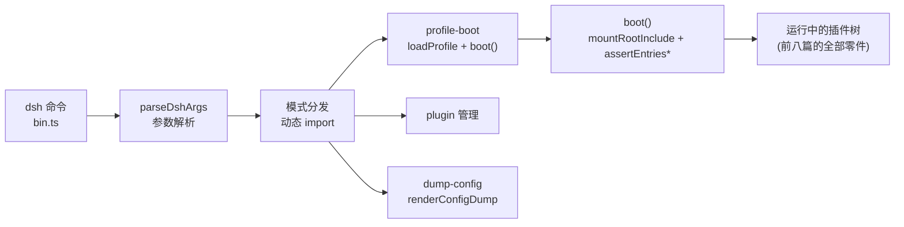

# 【第 09 篇】应用层：apps/cli 与 boot——产品如何被启动

> 难度：🟢 入门（本篇偏用户视角，无深坑）
> 前置阅读：`第01篇-vendor-Cordis框架层.md`
> 对应目录：`deepseek-harness/apps/cli/`、`deepseek-harness/packages/boot/`

## 目录

- [0 功能需求（WHY）](#0-功能需求why)
- [1 架构设计（WHAT）](#1-架构设计what)
- [2 实现落点（HOW）](#2-实现落点how)
- [3 产物演示（EXAMPLE）](#3-产物演示example)
- [4 动手验证](#4-动手验证🧪)
- [5 FAQ 与自测](#5-faq-与自测❓)
- [6 延伸阅读](#6-延伸阅读📚)

---

## 0 功能需求（WHY）

### 0.1 背景与场景

前八篇讲的是"零件"（插件、主干、能力、记忆、多智能体、治理）。但用户不组装零件——用户只敲一个命令：

```powershell
dsh web
dsh --profile headless "把 tests 跑一遍"
```

这个命令背后是 `apps/cli` + `packages/boot/`：**产品启动器**。三个场景：

1. **多形态入口**：一个命令，四种形态（web / headless / plugin 管理 / dump-config 审计）；
2. **配置复杂**：插件树由多层配置叠成（bundle 补丁 → profile 补丁 → 用户补丁 → --patch 覆盖），启动器要正确合并；
3. **失败要大声**：启动失败必须给出一行可诊断的错误并退出码非零——不能静默半启动。

### 0.2 需求陈述

**R1 · 命令入口统一**——`dsh` 一个命令，按模式分发：`--profile <name>` 启动、`--profile headless "任务"` 一次性任务、`dsh web` 别名、`dsh plugin` 管理插件、`--dump-config` 打印配置树。

- 实例：官方原文 *"The `dsh` command is the product launcher for profiles: ordered stacks of plugin-bundle patch layers under the user's own overrides"*（[apps/cli/README.md 第 5 行](../deepseek-harness/apps/cli/README.md)）。
- 为什么必须：产品形态多，入口必须少；一个命令 + 参数 = 学习成本最低。

**R2 · 启动组合可复现**——启动 = 把 profile 的 bundle 层叠按序合并成配置树并加载；`--dump-config` 离线输出**与真实启动完全一致**的组合结果。

- 实例：`renderConfigDump` 用 include 自己的解析器与 patch 算法离线组合（[app-boot/README.md 第 22 行](../deepseek-harness/packages/boot/app-boot/README.md)）——"组合、标志派生、配置 dump 永不与启动漂移"。
- 为什么必须：配置审计（第 01 篇 N1）要求"打印的"等于"启动的"。

**R3 · 启动失败大声且干净**——Loader 失败/插件未解析/插件激活失败 → 带标签的一行错误 + `exit(1)`；部分启动的上下文要**先清理再退出**（终端恢复）。

- 实例：`installFailLoud` + `assertEntriesLoaded`/`assertEntriesActivated`（[app-boot/README.md 第 12~15 行](../deepseek-harness/packages/boot/app-boot/README.md)）。
- 为什么必须：半启动的产品比不启动更危险（终端残留 raw mode 等）；静默失败无法诊断。

**R4 · profile 即目录**——profile 是 `$DSH_HOME/profiles/<name>` 下的一个目录：package.json（`dsh.profile` 声明 bundles 顺序）+ 用户 `cordis.patch.yml`；`web`/`headless` 首次使用自动初始化。

- 实例：`PROFILE_TEMPLATES`（web、headless）首次使用自动初始化，其他名字必须 `dsh plugin` 创建（[app-boot/README.md 第 38 行](../deepseek-harness/packages/boot/app-boot/README.md)）。
- 为什么必须：用户配置与产品安装分离——升级产品不碰用户配置。

### 0.3 非功能需求

| 编号 | 约束 | 衡量方式 |
|---|---|---|
| N1 | **模式隔离**：bin 按模式动态 import，无关模式不进分发路径 | 启动 web 不加载 plugin 代码 |
| N2 | **环境分层**：环境快照 = 继承 > 项目 .env > 用户 .env，bootstrap 文件变量被拒 | 环境优先级确定且可审计 |
| N3 | **超时兜底**：失败退出前的 release 清理有超时（`FAIL_LOUD_RELEASE_TIMEOUT_MS`），卡住延迟退出、绝不取消退出 | 终端必恢复 |
| N4 | **配置解析一致**：dump 与启动共用 include 的 parser/patch 算法 | 打印 = 启动 |
| N5 | **退出码契约**：配置错误、启动失败全部非零退出 | 脚本可判断成败 |

### 0.4 验收标准

| 需求 | 验收示例（做到 = 通过） | 失败示例（做不到 = 没通过） |
|---|---|---|
| R1 | `dsh web`、`dsh --profile headless "任务"`、`dsh --dump-config` 各自正常 | 模式间互相干扰 |
| R2 | `--dump-config` 输出与 `boot()` 实际挂载的树一致 | dump 与启动漂移 |
| R3 | 插件名写错 → 一行错误列出未解析插件 + 退出码 1 | 半启动后进程挂着 |
| R4 | 首次 `dsh web` 自动生成 web profile；`dsh --profile foo` 提示需创建 | profile 目录手动拼装 |

### 0.5 边界与不做什么

- **不做功能实现**：cli 只"启动产品"，产品功能全在 packages/（前八篇）。
- **不做 GUI**：`apps/web` 是前端源码（Vite 构建），启动后由 host 半区服务（下一篇）。
- **不做发布管理**：`scripts/release/` 负责发布（后续篇目）。

### 0.6 设计哲学（原则 → 引出的需求）

| 原则 | 内容 | 引出的需求 |
|---|---|---|
| P1 一个入口，按模式分发 | bin 薄、动态 import、模式隔离 | R1 / N1 |
| P2 打印即启动 | dump 与 boot 共用同一解析与 patch 算法 | R2 / N4 |
| P3 失败大声且干净 | 标签错误 + 退出码 + 先清理后退出 | R3 / N3 |
| P4 配置与安装分离 | profile 在 Harness home，产品在安装目录 | R4 |

### 0.7 备选技术路径

| 路径 | 思路 | 优势 | 代价 | 需求匹配 |
|---|---|---|---|---|
| A. 每形态一个 bin | dsh-web / dsh-headless / dsh-acp 各自入口 | 各自简单 | 入口爆炸、共享逻辑重复 | R1 落空 |
| B. 单 bin 静态加载 | 一个入口一次性加载所有模式代码 | 分发简单 | 无关代码常驻内存、启动变慢 | N1 落空 |
| C. 单 bin + 动态分发（**本项目**） | 解析参数 → switch → 按模式 import | 模式隔离、入口唯一 | bin 要处理参数契约 | 满足 R1/N1 |
| D. 手写配置合并 | 启动器自己实现补丁合并 | 无 include 依赖 | 与 include 的算法必然漂移 | R2 落空 |
| E. 复用 include 算法（**本项目**） | 组合/导出共用 `applyEntryPatches` | 打印 = 启动 | 依赖 vendor/include 的导出 | 满足 R2 |

**选型结论**：入口要少（C）、组合要真（E）、失败要响（P3）——启动器是"薄胶水"，把一切重活留给第 01 篇的装配层与 include 算法。

## 1 架构设计（WHAT）

### 1.1 总体架构：一条命令的五段旅程



**四步读懂**：

1. **入口**（bin.ts）是薄壳：解析参数（`parseDshArgs`），按模式**动态 import** 对应模块（N1 模式隔离）；
2. **profile-boot** 走主路径：加载 profile（bundles 列表）→ `boot()` 创建根上下文、安装 Loader、挂载 include 树、断言条目加载与激活（R3）；
3. **dump-config** 走审计路径：`renderConfigDump` 用 include 自己的算法离线组合并打印（R2）；
4. **plugin 管理**：转发给 pnpm 在 profile 目录安装/移除插件（R4 的配套）。

### 1.2 关键架构决策（需求 → 方案 → 权衡）

| # | 决策 | 对应需求 | 权衡 |
|---|---|---|---|
| D1 | **动态 import 分发**：只有有效模式进入对应路径 | R1 / N1 | bin 用顶层 await；换来模式隔离 |
| D2 | **boot() 单一启动函数**：建 ctx → 装 Loader → prepare → 挂 include → 断言 | R3 | 启动逻辑集中；换来失败路径单一 |
| D3 | **renderConfigDump 共用 include 算法**：`entryListSchema`/`applyEntryPatches` 导出 | R2 / N4 | vendor/include 要导出内部函数；换来打印=启动 |
| D4 | **profile 目录 + 模板自举**：web/headless 首次自动初始化 | R4 | 模板要随产品发布；换来零配置上手 |
| D5 | **installFailLoud + release 清理**：失败先清理（如恢复终端）再退出，超时兜底 | R3 / N3 | 清理逻辑要跨 bin 共享；换来退出必干净 |

### 1.3 关系网

- **上游**：`app-boot` 是共享启动胶水（`dsh` 与 `dsh-acp-demo` 都用它）；`boot()` 内部用 vendor 的 Loader/include/hmr；
- **下游**：bin 的 `profile-boot` 消费 `resolveProfileDir`/`loadProfile`/`boot`；`dump-config` 消费 `renderConfigDump`；
- **平级**：`cmdline` 包提供应用参数解析（启动后的 `--port` 等归 web 应用）；`process-shutdown` 处理进程退出。

## 2 实现落点（HOW）

### 2.1 文件导航表（按阅读顺序）

| 顺序 | 文件（点击直达） | 关注点 | 对应需求 |
|---|---|---|---|
| 1 | [apps/cli/src/bin.ts](../deepseek-harness/apps/cli/src/bin.ts) | 入口分发：动态 import 按模式（第 27~50 行） | R1 / N1 |
| 2 | [apps/cli/src/args.ts](../deepseek-harness/apps/cli/src/args.ts) | 参数语法（--profile/--patch/--dump-config） | R1 |
| 3 | [apps/cli/src/profile-boot.ts](../deepseek-harness/apps/cli/src/profile-boot.ts) | 主启动路径 | R2/R3 |
| 4 | [apps/cli/src/dump-config.ts](../deepseek-harness/apps/cli/src/dump-config.ts) | 配置审计路径 | R2 |
| 5 | [packages/boot/app-boot/src/index.ts](../deepseek-harness/packages/boot/app-boot/src/index.ts) | `boot()`、`mountRootInclude`、`renderConfigDump` | R2/R3 |
| 6 | [apps/cli/config/agent-presets](../deepseek-harness/apps/cli/config/agent-presets) | 内置 agent 预设（code/cordis/minimal/standard） | R4 |

### 2.2 关键实现片段

**片段 A：一个命令，四种模式**（[bin.ts 第 29~49 行](../deepseek-harness/apps/cli/src/bin.ts)）

```ts
switch (invocation.mode) {
  case 'profile': {
    const { runProfile } = await import('./profile-boot.ts')
    await runProfile({ environment: loadLayeredEnv('dsh'), profile: invocation.profile, … })
    break
  }
  case 'dump-config': {
    const { runDumpConfig } = await import('./dump-config.ts')
    runDumpConfig(invocation.profile, invocation.defaultOnly, invocation.patches)
    break
  }
}
```

翻译：`bin.ts` 是**薄分发壳**——先 `parseDshArgs` 解析参数，再按模式**动态 import** 对应实现。注释说明了设计：*"Dynamic imports per mode keep unrelated modes out of each dispatch path"*（第 3 行）——启动 web 不加载 plugin/dump 的代码（N1 模式隔离）。

**片段 B：dump 与启动共用同一算法**（[app-boot/README.md 第 22 行](../deepseek-harness/packages/boot/app-boot/README.md)）

> `renderConfigDump` … Compose the base config and labeled overlay layers offline with the include's own parser and patch algorithm (`entryListSchema`/`applyEntryPatches`), so the result equals what `boot()` mounts …

翻译：`renderConfigDump` 不用自己写的合并逻辑，而是**复用 include 的解析器与补丁算法**（vendor/include 导出的 `entryListSchema`/`applyEntryPatches`）——"打印的"与"启动的"出自同一段代码（R2/N4）。第 01 篇动手任务里看到的 `# == ...` 分层注释就是 `renderConfigDump` 为每层打的标签。

**片段 C：失败大声的守卫**（[app-boot/README.md 第 12~15 行](../deepseek-harness/packages/boot/app-boot/README.md)）

> `installFailLoud` — Turn an unhandled boot or later Loader rejection into one labelled stderr line + `exit(1)` … `assertEntriesLoaded` — Throw when a settled tree holds an enabled entry with no fiber, reporting every unresolved plugin name …

翻译：两道守卫：`installFailLoud` 把未处理的启动/加载拒绝变成**一行带标签的 stderr + exit(1)**（P3）；`assertEntriesLoaded`/`assertEntriesActivated` 审计"配置里有、树里没有"的条目——插件名写错会在启动时被点名，而不是静默半启动（R3）。

### 2.3 符号 hover 指引

在 VS Code 打开 [packages/boot/app-boot/src/index.ts](../deepseek-harness/packages/boot/app-boot/src/index.ts) hover `boot`、`renderConfigDump`、`installFailLoud` 查看完整 JSDoc 契约。

## 3 产物演示（EXAMPLE）

### 3.1 输入

一条命令（**已实测**，仓库根目录执行）：

```powershell
pnpm dsh --profile headless --dump-config > dump.yml
```

概念输入：`headless` profile 模板 = `dsh-base` + `dsh-headless` 两个 bundle（第 01 篇见过）。

### 3.2 产物（真实 dump 输出的分层标签）

> 以下为命令实际输出（全量 333 行）的关键片段；行号与注释列为本文档添加。

<table style="border-collapse:collapse;width:100%;font-size:13px">
  <tr style="background:#f6f8fa">
    <th style="border:1px solid #d0d7de;padding:5px 8px;width:36px">行</th>
    <th style="border:1px solid #d0d7de;padding:5px 8px">真实产物（dump.yml）</th>
    <th style="border:1px solid #d0d7de;padding:5px 8px">行内注释</th>
  </tr>
  <tr>
    <td style="border:1px solid #d0d7de;padding:5px 8px;text-align:center;color:#57606a">1</td>
    <td style="border:1px solid #d0d7de;padding:5px 8px;font-family:monospace"># == @deepseek-ai/dsh-base</td>
    <td style="border:1px solid #d0d7de;padding:5px 8px">分层标签：下面条目来自 base bundle（renderConfigDump 生成）</td>
  </tr>
  <tr>
    <td style="border:1px solid #d0d7de;padding:5px 8px;text-align:center;color:#57606a">2</td>
    <td style="border:1px solid #d0d7de;padding:5px 8px;font-family:monospace">- id: timer</td>
    <td style="border:1px solid #d0d7de;padding:5px 8px">定时器插件条目</td>
  </tr>
  <tr>
    <td style="border:1px solid #d0d7de;padding:5px 8px;text-align:center;color:#57606a">3</td>
    <td style="border:1px solid #d0d7de;padding:5px 8px;font-family:monospace"># == @deepseek-ai/dsh-base, patched by @deepseek-ai/dsh-headless</td>
    <td style="border:1px solid #d0d7de;padding:5px 8px"><b>🎯 层叠标签</b>：该层被 headless 补丁修改过（R2 组合的直接证据）</td>
  </tr>
  <tr>
    <td style="border:1px solid #d0d7de;padding:5px 8px;text-align:center;color:#57606a">4</td>
    <td style="border:1px solid #d0d7de;padding:5px 8px;font-family:monospace">- id: hmr … disabled: true</td>
    <td style="border:1px solid #d0d7de;padding:5px 8px">headless 补丁把 hmr 禁用（第 01 篇 R1 实例）</td>
  </tr>
</table>

### 3.3 发生了什么（命令 → 产出的四步）

1. `parseDshArgs` 识别 `dump-config` 模式 → 动态 import `dump-config.ts`（N1）；
2. `runDumpConfig` 读取 headless profile 的 bundles 列表（dsh-base → dsh-headless）；
3. `renderConfigDump` 用 include 的 parser/patch 算法离线组合，逐层打上 `# ==` 标签；
4. 输出 YAML 写入 dump.yml——**与 `boot()` 真实挂载的树逐行一致**（R2/N4）。

### 3.4 观察点（对应产物表中的行号）

- **行 1、3 的 `# ==` 标签**：每层来源与"被谁 patch"一目了然（R2 可审计）；
- **行 4 的 `disabled: true`**：补丁层的修改生效——headless 补丁覆盖了 base 的 hmr（组合语义）；
- **整体**：你看到的 333 行就是 `boot()` 会加载的树——"打印即启动"（P2）。

## 4 动手验证（🧪）

> 以下命令已在本机实测（仓库根目录 `deepseek-harness\deepseek-harness` 下执行）。

### 任务 1：复现第 3 节产物

```powershell
pnpm dsh --profile headless --dump-config > dump.yml
```

**预期**：无报错，`$LASTEXITCODE` 为 0，dump.yml 约 333 行。**判据**：对照第 3.2 节——分层标签、hmr disabled 都在。

### 任务 2：看入口分发

打开 [apps/cli/src/bin.ts](../deepseek-harness/apps/cli/src/bin.ts)，数一数 switch 里有几个模式分支（profile / plugin / dump-config / 其他）。**判据**：每个 case 都是 `await import(...)` 动态加载。

### 任务 3（进阶）：制造一次"失败要大声"

```powershell
pnpm dsh --profile headless --patch "no-such-file.yml" --dump-config
```

**预期**：退出码非零，stderr 出现带 `dsh` 标签的错误行。**判据**：失败是"一行标签 + 非零退出"，而不是静默半启动（R3）。

## 5 FAQ 与自测（❓）

### FAQ

- **Q1：`dsh web` 和 `dsh --profile web` 什么区别？** 没有——`web` 是 `--profile web` 的别名（[apps/cli/README.md 第 13 行](../deepseek-harness/apps/cli/README.md)）。
- **Q2：profile 存在哪里？** `$DSH_HOME/profiles/<name>`（`$DSH_HOME` 未设时是 `~/.dsh`）——用户配置与产品安装分离（R4）。
- **Q3：`--dump-config` 需要 API key 吗？** 不需要。它打印的是"蓝图"（配置树），不启动模型、不连网络——所以它可以做 CI 审计。
- **Q4：为什么失败要"先清理再退出"？** 因为部分启动的上下文可能已经接管终端（raw mode 等）；不清理就退出，用户的 shell 会残留异常状态（N3）。
- **Q5：`dsh plugin` 是干什么的？** 在 profile 目录里转发 pnpm 命令（安装/移除插件），是创建非模板 profile 的必经路径（R4）。

### 自测（答案折叠在下方）

1. `bin.ts` 为什么用动态 import？
2. `renderConfigDump` 与 `boot()` 如何保证一致？
3. `installFailLoud` 把失败变成什么？
4. profile 目录在哪个位置？web/headless 首次使用会发生什么？
5. 下列哪个不属于本组职责？A. 参数解析 B. 插件树挂载 C. 模型请求 D. 配置 dump

<details>
<summary>点开看答案</summary>

1. 模式隔离（N1）：启动 web 不加载 plugin/dump 的代码。
2. 共用 include 的 parser 与 patch 算法（`entryListSchema`/`applyEntryPatches`），同一段代码两个用途。
3. 一行带标签的 stderr + `exit(1)`（P3 失败大声）。
4. `$DSH_HOME/profiles/<name>`（默认 `~/.dsh/profiles`）；web/headless 首次使用自动从模板初始化。
5. C。模型请求属于 `packages/llm/`（第 04 篇）。

</details>

## 6 延伸阅读（📚）

**官方（权威来源）**：

- [apps/cli/README.md](../deepseek-harness/apps/cli/README.md) —— 入口模式与参数契约（47 行）
- [packages/boot/app-boot/README.md](../deepseek-harness/packages/boot/app-boot/README.md) —— 启动胶水全导出（60 行，信息密度高）
- [docs/architecture.md](../deepseek-harness/docs/architecture.md) —— "Profiles and bundles" 一节（组合语义）
- [docs/config-catalog.md](../deepseek-harness/docs/config-catalog.md) —— 生成的配置字段目录

**外部文献（按难度递增）**：

- 🟢 [12-Factor: Config](https://12factor.net/config) —— 环境分层（N2）的参照系
- 🟡 [Node.js process.loadEnvFile](https://nodejs.org/api/process.html#processloadenvfilepath) —— `.env` 加载的宿主机制
- 🔴 [npm package.json 的 "dsh" 字段规范](https://github.com/deepseek-ai/deepseek-harness) —— bundle/profile 清单声明的落地（见仓库 packages/bundle/*/package.json）

---

**下一篇预告**：【第 10 篇】GUI 前后端：apps/web + host + client——从浏览器到主机的桥梁。
