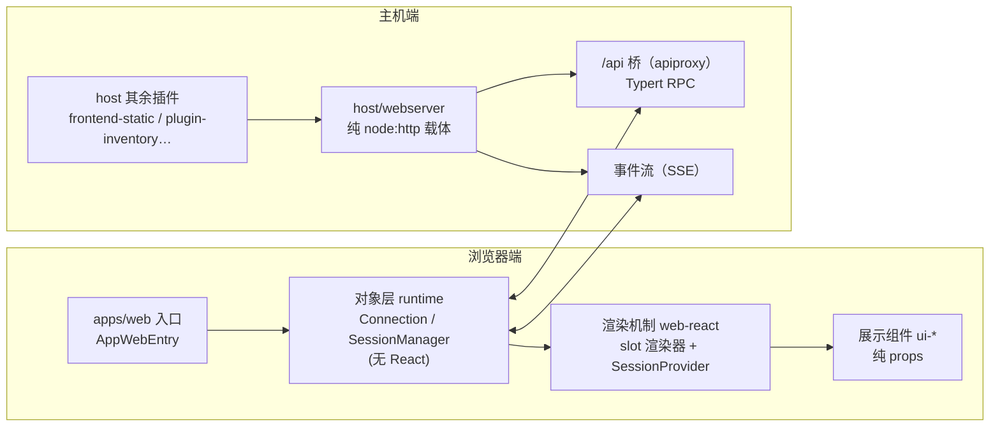

# 【第 10 篇】GUI 前后端：apps/web + host + client——浏览器到主机的桥梁

> 难度：🟢 入门（前端只讲架构组织，不抠技术细节）
> 前置阅读：`第09篇-应用层cli与boot.md`
> 对应目录：`deepseek-harness/apps/web/`、`deepseek-harness/packages/host/`、`deepseek-harness/packages/client/`

## 目录

- [0 功能需求（WHY）](#0-功能需求why)
- [1 架构设计（WHAT）](#1-架构设计what)
- [2 实现落点（HOW）](#2-实现落点how)
- [3 产物演示（EXAMPLE）](#3-产物演示example)
- [4 动手验证](#4-动手验证🧪)
- [5 FAQ 与自测](#5-faq-与自测❓)
- [6 延伸阅读](#6-延伸阅读📚)

---

## 0 功能需求（WHY）

### 0.1 背景与场景

前九篇的产品都是"无头"的（headless 跑任务、日志可审计）。但产品要给**人**用，就需要一个 GUI。三个场景：

1. **实时会话**：用户在浏览器里看到 Agent 的思考、工具调用、结果**实时滚动**（SSE 事件流）；
2. **界面可扩展**：GUI 的每个区块（对话、侧边栏、设置、工具视图）都要能由插件贡献——UI 本身也是插件；
3. **职责不混**：浏览器只管"怎么画"，模型可见的事实永远来自会话日志——**UI 是纯展示层**。

### 0.2 需求陈述

**R1 · 浏览器载体与业务分离（host）**——`dsh-host-webserver` 是纯 `node:http` 载体：**不知道任何 harness 概念**，只提供命名路由注册、index.html 变换、一个 fallback 席位；所有功能路由（/api 桥、插件 bundle、HMR 事件流）由插件注册。

- 实例：官方原文 *"It is not part of the agent loop and not a capability seam; it knows no harness concepts, and another plugin registers every feature route"*（[web-server.md 第 5 行](../../deepseek-harness/docs/subsystems/web-server.md)）。
- 为什么必须：HTTP 服务器是"管道"，业务是"水"——管道不装水，水由插件注入。

**R2 · UI 即插件（client）**——浏览器端由插件组合：`ui-slots` 定义注册/渲染协议（`slots.register`），39 个 `ui-*` 包各贡献一个界面区域。

- 实例：官方原文 *"a plugin composes UI only through `ctx.slots.register({ name, children?, store?, inject? }, Component)"*（[packages/client/AGENTS.md](../../deepseek-harness/packages/client/AGENTS.md)）。
- 为什么必须：UI 与功能同构（一切皆插件，第 01 篇 P1 在浏览器端的延伸）。

**R3 · 三层分离**——浏览器端严格分三层：**数据对象层**（`runtime`，无 React：连接/会话/重连状态机）、**渲染机制**（`web-react`，shell 专属：ctx→React 的桥）、**展示组件**（各 ui-* 包的 `src/client/`，纯 props）。

- 实例：官方原文 *"Business data lives in the object layer, never a store"*（[packages/client/AGENTS.md](../../deepseek-harness/packages/client/AGENTS.md)）。
- 为什么必须：业务状态与展示分离 = 可测试、可重放、可重写 UI。

**R4 · 实时事件流**——浏览器经 SSE 事件流观察 `session/event`，会话进展实时渲染；连接由 `connection` 包维护（RPC + 事件投递 + 重连）。

- 实例：第 02 篇的"循环可观测"（R3）在浏览器端的消费方式——UI 渲染来自事件流，不是轮询。
- 为什么必须：Agent 过程是流式的；轮询 = 假实时。

**R5 · 纯展示原则**——Web 层是纯展示：模型可见的新输入**仍然必须**是会话事件（仓库级规则），UI 从不绕过日志直接喂模型。

- 实例：官方原文 *"The web layer is pure presentation. … A new model-visible input still requires a session event (repo-wide rule)"*（[packages/client/AGENTS.md](../../deepseek-harness/packages/client/AGENTS.md)）。
- 为什么必须：UI 是日志的"渲染器"之一——绕过日志 = 破坏第 02 篇 R1。

### 0.3 非功能需求

| 编号 | 约束 | 衡量方式 |
|---|---|---|
| N1 | **监听安全**：webserver 默认只听 `127.0.0.1`；`0.0.0.0` 是显式网络暴露（无 TLS/auth/来源策略） | 默认姿态 = loopback |
| N2 | **SPA 语义**：dist 静态服务锁定规则（非 GET/HEAD=405、越界=403、miss 回 index.html=200） | 刷新路由不 404 |
| N3 | **连接自愈**：connection 包维护 RPC + 事件 + 重连状态机 | 断线自动重连 |
| N4 | **纯 JSON 通信**：UI 域间只共享 JSON 兼容数据与回调（slot 协议） | 无跨包 ReactNode 泄漏 |
| N5 | **可重放渲染**：展示组件吃 props，事件窗口按 seq 重放 | UI 可回放历史 |

### 0.4 验收标准

| 需求 | 验收示例（做到 = 通过） | 失败示例（做不到 = 没通过） |
|---|---|---|
| R1 | 新增功能路由 = 注册一个插件路由，不动 webserver | 加功能要改 HTTP 服务器 |
| R2 | 新增界面区域 = 注册一个 slot 贡献，不动 shell | 加 UI 要改入口文件 |
| R3 | runtime 包零 React import（grep 可断言）；展示组件无业务逻辑 | 业务状态泄漏进组件 |
| R4 | 模型流式输出在浏览器实时渲染 | 只能等最终结果 |
| R5 | 用户输入经 session 事件落账后才进模型请求 | UI 绕过日志直发模型 |

### 0.5 边界与不做什么

- **webserver 不鉴权**：loopback 默认姿态即安全边界；网络暴露是显式选择（N1）。
- **不做渲染细节**：CSS 细节、组件库选型是 `ui-theme`/`ui-primitives` 的事；本篇只讲架构组织。
- **不做 Electron**：Electron 走 `file://` + IPC 桥，不经 webserver（[web-server.md 第 5 行](../../deepseek-harness/docs/subsystems/web-server.md)）。
- **UI 不产生模型可见输入**：一切模型可见内容仍须会话事件（R5）。

### 0.6 设计哲学（原则 → 引出的需求）

| 原则 | 内容 | 引出的需求 |
|---|---|---|
| P1 管道不装水 | webserver 纯载体，功能路由全由插件注册 | R1 |
| P2 UI 也是插件 | 界面区域经 slot 系统注册/组合 | R2 |
| P3 数据与渲染分离 | 对象层无 React，组件层无业务 | R3 |
| P4 事件驱动渲染 | 浏览器消费 session/event 流 | R4 |
| P5 展示不造事实 | UI 是渲染器，模型可见输入必须过日志 | R5 |

### 0.7 备选技术路径

| 路径 | 思路 | 优势 | 代价 | 需求匹配 |
|---|---|---|---|---|
| A. 全栈单体 | 一个服务器既管 HTTP 又写死页面路由 | 部署简单 | 加功能改服务器；前后端耦合 | R1 落空 |
| B. 静态 UI + 轮询 | 前端轮询最终结果 | 实现简单 | 无实时性；无插件化 | R2/R4 落空 |
| C. 载体 + 路由注册（**本项目**） | webserver 纯载体，插件注册路由 | 功能路由自由生长 | 路由契约要治理（重复注册抛错） | 满足 R1 |
| D. 大组件库硬编码 | 界面写死在一个包 | 简单直接 | 无法扩展、无法裁剪 | R2 落空 |
| E. slot 插件系统（**本项目**） | register/renderSlot + 四份 props | 界面完全插件化 | slot 契约复杂（声明即授权） | 满足 R2/R3 |
| F. UI 直发模型 | 前端直接调模型接口 | 路径短 | 绕过日志，破坏可重放 | R5 落空 |

**选型结论**：浏览器端复刻了产品端的全部哲学——**插件化（P2）、分层（P3）、事件驱动（P4）、日志为唯一真相（P5）**。GUI 不是"另一个产品"，而是同一产品的另一种视图。

## 1 架构设计（WHAT）

### 1.1 总体架构：浏览器与主机之间的两座桥



**四步读懂**：

1. **入口**（apps/web/src/main.ts）是 10 行薄壳：找 `#root`，启动 `AppWebEntry`——一切装载逻辑在 `client-web` 包（R2）；
2. **浏览器三层**：对象层管"事实"（连接/会话，无 React）、渲染机制管"桥"（ctx→React，shell 专属）、展示组件管"画"（纯 props）——R3 的物理分层；
3. **主机端**：webserver 是纯载体；`apiproxy` 提供 /api 桥（Typert RPC，第 04 篇）、SSE 提供事件流（R4）——两者都是注册进 webserver 的插件路由（R1）；
4. **通信规则**：浏览器↔主机走 RPC + 事件流；UI 想给模型说话，必须经会话事件落账（R5）。

### 1.2 关键架构决策（需求 → 方案 → 权衡）

| # | 决策 | 对应需求 | 权衡 |
|---|---|---|---|
| D1 | **webserver 纯载体 + 路由注册**：named route + fallback 席位（第二注册抛错） | R1 / N1 | 路由契约要治理；换来功能路由自由生长 |
| D2 | **slot 系统声明即授权**：`children` 声明 + 渲染即渲染声明过的 hole；冲突在加载时报错 | R2 | slot 命名要镜像组合路径；换来插件间零隐式耦合 |
| D3 | **三层分离 + 对象层无 React**（grep 可断言） | R3 | 组件要经 props 拿一切；换来可测试可重放 |
| D4 | **SSE 事件流 + 重连状态机** | R4 / N3 | 连接状态机复杂；换来真实时 |
| D5 | **UI 不产生模型可见输入** | R5 | 新输入必须走会话事件；换来"模型可见⟺已记录"不破 |

### 1.3 关系网

- **上游**：host 的 webserver 被 `frontend-static`（SPA 静态服务，认领 fallback 席位）、`apiproxy`（/api 桥）、`plugin-inventory`（插件目录）等消费；`client/modules` 用 `tapIndex` 注入启动 manifest；
- **下游**：client 的 `connection` 与主机通信；`runtime` 消费 `session/event`；39 个 ui-* 包经 `ui-slots` 注册进 shell；
- **平级**：`apps/web` 是构建入口（Vite），构建产物由 `frontend-static` 服务。

## 2 实现落点（HOW）

### 2.1 文件导航表（按阅读顺序）

| 顺序 | 文件（点击直达） | 关注点 | 对应需求 |
|---|---|---|---|
| 1 | [apps/web/src/main.ts](../../deepseek-harness/apps/web/src/main.ts) | 入口薄壳（10 行，全部逻辑在 client-web） | R2 |
| 2 | [packages/host/webserver/src/index.ts](../../deepseek-harness/packages/host/webserver/src/index.ts) | `WebRoute`/`WebRouteKind`、`Config`（host/port） | R1 / N1 |
| 3 | [packages/client/connection/src](../../deepseek-harness/packages/client/connection/src) | RPC + 事件投递 + 重连 | R4 / N3 |
| 4 | [packages/client/runtime/src](../../deepseek-harness/packages/client/runtime/src) | 对象层：ConnectionController → SessionManager → Session | R3 |
| 5 | [packages/client/web-react/src](../../deepseek-harness/packages/client/web-react/src) | ctx→React 桥（slot 渲染器、SessionProvider） | R2/R3 |
| 6 | [packages/client/ui-slots/src](../../deepseek-harness/packages/client/ui-slots/src) | slot 注册/渲染协议 | R2 |
| 7 | [packages/host/frontend-static/src/index.ts](../../deepseek-harness/packages/host/frontend-static/src/index.ts) | SPA 静态服务（405/403/回退 200） | N2 |

### 2.2 关键实现片段

**片段 A：10 行的应用入口**（[apps/web/src/main.ts](../../deepseek-harness/apps/web/src/main.ts)）

```ts
import { AppWebEntry } from '@deepseek-ai/dsh-client-web'

const el = document.getElementById('root')
if (el === null) throw new Error('web app: missing #root')
void new AppWebEntry(el).run()
```

翻译：整个前端入口只有三件事——找挂载点、检查存在、启动。文件头注释说明了设计：*"Everything — loader holding, module-table seeding, AppRoot gate, plugin assembly — lives in @deepseek-ai/dsh-client-web; this file only finds the mount point"*（第 2~4 行）——入口薄、逻辑进插件（R2）。

**片段 B：路由契约**（[webserver/src/index.ts 第 11~25 行](../../deepseek-harness/packages/host/webserver/src/index.ts)）

```ts
type WebRouteKind = 'exact' | 'prefix'

interface WebRoute {
  kind: WebRouteKind
  path: string
  handler: (req: IncomingMessage, res: ServerResponse) => void | Promise<void>
}
```

翻译：路由契约只有三字段——匹配方式（精确/前缀）、路径、处理器（可持开响应，如 SSE）。官方语义（[web-server.md 第 27 行](../../deepseek-harness/docs/subsystems/web-server.md)）：匹配顺序固定（exact 表 → 最长前缀 → fallback），注册顺序**不携带请求语义**；fallback 席位只有一个主人，第二注册抛错（R1 的契约治理）。

**片段 C：监听配置的两种姿态**（[webserver/src/index.ts 第 32~39 行](../../deepseek-harness/packages/host/webserver/src/index.ts)）

```ts
interface Config {
  host: '127.0.0.1' | '0.0.0.0'
  port: number
}
```

翻译：`host` 只接受两个值——loopback（默认姿态）与 all-interfaces（显式网络暴露）。官方警告（[web-server.md 第 41 行](../../deepseek-harness/docs/subsystems/web-server.md)）：*"there is no TLS, auth, or origin policy, so a non-loopback bind exposes the server to that network"*——没有鉴权兜底，loopback 就是安全边界（N1）。

### 2.3 符号 hover 指引

在 VS Code 打开 [packages/host/webserver/src/index.ts](../../deepseek-harness/packages/host/webserver/src/index.ts) hover `WebRoute`、`register`、`tapIndex`；打开 [packages/client/runtime/src](../../deepseek-harness/packages/client/runtime/src) 的会话目录 hover `SessionManager`。

## 3 产物演示（EXAMPLE）

### 3.1 输入

两个真实文件：前端入口（[apps/web/src/main.ts](../../deepseek-harness/apps/web/src/main.ts)，10 行）与主机路由契约（[packages/host/webserver/src/index.ts](../../deepseek-harness/packages/host/webserver/src/index.ts) 的 `WebRoute`/`Config`，见 2.2 片段 B/C）。

### 3.2 产物（真实前端构建产物目录）

> 以下为仓库现存构建输出的目录结构（`apps/web/dist`，Vite 构建产物）；命令与产物已在本机实测。

```text
apps/web/dist/
├── index.html          # 挂载 #root 的入口页（AppWebEntry 的宿主）
├── assets/             # 打包后的 JS/CSS 资源（client 插件 bundle 的产物）
└── …（Vite 标准输出）
```

配套产物——`frontend-static` 对这份产物的服务语义（[web-server.md 第 27 行](../../deepseek-harness/docs/subsystems/web-server.md) 原文）：

> the SPA dist server with locked semantics: non-GET/HEAD is 405, traversal outside the dist root is 403, any miss falls back to `index.html` with HTTP 200 (SPA routing), and unknown extensions ship as octet-stream.

### 3.3 发生了什么（源码 → 浏览器页面的四步）

1. `apps/web`（Vite）把入口与 client 插件 bundle 构建成 `dist/`（产物目录）；
2. 启动 `dsh web` 时，`frontend-static` 认领 webserver 的 fallback 席位，服务这份 dist（N2 锁定语义）；
3. 浏览器请求 `/` → `index.html` → `main.ts` 找到 `#root` → `AppWebEntry` 启动 shell；
4. shell 经 `connection` 建立 RPC + 事件流，对象层开始消费 `session/event`——GUI 活了（R4）。

### 3.4 观察点（对应产物中的行号/文件）

- **`main.ts` 只有 10 行**：入口薄壳原则（R2）——所有装载逻辑在 `client-web` 插件包里；
- **`Config.host` 只有两个取值**：loopback 默认姿态（N1）——"默认安全、显式暴露"；
- **fallback 席位单主人**：`frontend-static` 认领后第二注册抛错（R1 契约治理）。

## 4 动手验证（🧪）

> 以下命令已在本机实测（仓库根目录 `deepseek-harness\deepseek-harness` 下执行）。

### 任务 1：读入口薄壳

```powershell
Get-Content "apps\web\src\main.ts"
```

**预期**：10 行，只做三件事（找 #root、检查、启动）。**判据**：对照第 2.2 节片段 A——所有逻辑都在 `@deepseek-ai/dsh-client-web`。

### 任务 2：数一数浏览器插件

```powershell
(Get-ChildItem "packages\client" -Directory | Where-Object { Test-Path (Join-Path $_.FullName 'package.json') }).Count
```

**预期**：输出 39 左右（ui-* 与基础设施包）。**判据**：对照 [packages/client/README.md](../../deepseek-harness/packages/client/README.md) 的包清单——每个 UI 功能一个插件包（R2）。

### 任务 3（进阶）：看对象层无 React 的断言

打开 [packages/client/runtime/src](../../deepseek-harness/packages/client/runtime/src)，grep `react` 字样（应无 React import）；再对照 [packages/client/AGENTS.md](../../deepseek-harness/packages/client/AGENTS.md) 的"Zero React imports — grep-assertable"（R3 的物理保证）。

## 5 FAQ 与自测（❓）

### FAQ

- **Q1：浏览器和主机怎么通信？** 两层：RPC（`connection` 包的请求/响应，如 Typert 远程调用）+ 事件流（SSE 推送 `session/event`）——实时渲染靠后者（R4）。
- **Q2：我想给 GUI 加一个界面区块，改哪里？** 新建一个 `ui-*` 插件包，用 `ctx.slots.register` 注册进某个 slot——shell、入口、webserver 都不用动（R2）。
- **Q3：webserver 为什么"不知道 harness 概念"？** 因为它是管道：路由、SPA 语义、fallback 都是插件的契约；它只管 HTTP（R1）。这样换载体（如 Electron 的 IPC 桥）不影响功能路由。
- **Q4：UI 能不能直接给模型发消息？** 不能绕过日志。用户输入必须经会话事件落账后才进入模型请求（R5）——这是"模型可见⟺已记录"（第 02 篇 P1）在 GUI 端的延伸。
- **Q5：前端为什么要三层分离？** 对象层（事实）无 React → 可在 Node 里测试与重放；展示组件（画）纯 props → 可整包重写；渲染机制（桥）只此一家 → 变更收敛。任何一层可独立演进（R3）。

### 自测（答案折叠在下方）

1. webserver 的 fallback 席位有什么约束？
2. UI 插件通过什么注册进 shell？
3. 浏览器端哪一层"无 React"？为什么？
4. `Config.host` 的两个取值分别意味着什么？
5. 下列哪个不属于本组职责？A. 浏览器 RPC B. 会话日志 C. SSE 事件流 D. slot 渲染

<details>
<summary>点开看答案</summary>

1. 单主人：一个插件认领（shipped 组合是 frontend-static），第二注册抛错（R1）。
2. `ctx.slots.register({ name, children?, store?, inject? }, Component)`（ui-slots 协议，R2）。
3. 数据对象层 `runtime`——无 React 才能独立测试与重放（grep 可断言，R3）。
4. `127.0.0.1` = loopback 默认姿态；`0.0.0.0` = 显式网络暴露（无鉴权兜底，N1）。
5. B。会话日志属于 core/session（第 02 篇）。

</details>

## 6 延伸阅读（📚）

**官方（权威来源）**：

- [docs/subsystems/web-server.md](../../deepseek-harness/docs/subsystems/web-server.md) —— HTTP 载体契约（108 行）
- [packages/client/README.md](../../deepseek-harness/packages/client/README.md) —— 浏览器半区包清单
- [packages/host/README.md](../../deepseek-harness/packages/host/README.md) —— 主机半区包清单
- [docs/web-styling.md](../../deepseek-harness/docs/web-styling.md) —— 样式规范（--dsw-* 令牌体系）

**决策记录（WHY 的一手来源）**：

- 🔴 [.agents/notes/implemented/architecture/2026-07-19-gui-web-client-architecture.md](../../deepseek-harness/.agents/notes/implemented/architecture/2026-07-19-gui-web-client-architecture.md) —— Web 客户端架构（加载链、对象层、服务）
- 🔴 [.agents/notes/implemented/architecture/2026-07-22-slot-type-chain-implementation.md](../../deepseek-harness/.agents/notes/implemented/architecture/2026-07-22-slot-type-chain-implementation.md) —— slot 类型链（组合模型的定义）
- 🔴 [.agents/notes/implemented/architecture/2026-07-19-gui-layering-and-rpc-protocol.md](../../deepseek-harness/.agents/notes/implemented/architecture/2026-07-19-gui-layering-and-rpc-protocol.md) —— GUI 分层与 RPC 协议

**外部文献（按难度递增）**：

- 🟢 [Server-Sent Events（MDN）](https://developer.mozilla.org/en-US/docs/Web/API/Server-sent_events) —— SSE 事件流机制
- 🟡 [12-Factor: Dev/prod parity](https://12factor.net/dev-prod-parity) —— 前端构建与静态服务的部署哲学
- 🔴 [The Principles of UI Architecture（Clean Architecture 前端视角）](https://blog.cleancoder.com/uncle-bob/2016/01/04/ALittleArchitecture.html) —— 三层分离的思想源头

---

**下一篇预告**：【第 11 篇】协议与 SDK：sdk / acp / hooks / mcp / python。
